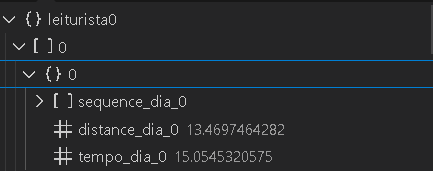

# Testes e resultados iniciais

&emsp;Primeiramente, o algoritmo desenvolvido inicialmente foi o *Nearest Neighbor* (NN) um algoritmo guloso que, a partir de um ponto inicial, busca o proximo nó com menor distância e escolhe este caminho. Ele é um algoritmo guloso, pois não leva em consideração caminhos futuros e combinações que por mais que não sejam vantajosas no inicio, no montante darão a menor distância total. Esta caracteristica faz com que ele seja rapido, mas não dê em casos mais complexos uma boa solução. Pode-se considerar que os resultados obtidos por ele sejam um *upper bound*, ou seja, um limiar superior de distância.

&emsp;Para executar os testes, utilizou-se o arquivo CSV da amostra total de dados tratado pela equipe, já contendo os *clusters* de leituristas e sub-*clusters* de dias obtidos na etapa anterior de processamento. Para os testes foram executados um TSP para cada *cluster* de dia para cada leiturista, totalizando 726 (33 leituristas x 22 dias) TSPs, foi utilizando o algoritimo guloso NN para obter um primeiro resultado de cada rota.

&emsp;Ao executar as células de teste que se encontra no notebook greedy.ipynb, cada *cluster* será selecionado e uma matriz de distancias será gerada para aquele conjunto de dados, com esta matriz, um TSP será executado com *Nearest Neighbors* e se obterá assim um dicionário contendo a sequencia de visita, a distancia percorrida e o tempo que levou para percorrer a rota para aquele *cluster* especifico. Além disso, este dado será adicionado em um dicionário que guardará todos os leituristas e os resultados de seus respectivos dias que será convertido em um arquivo JSON a seguinte estrutura:

Figura 01 - Estrutura do output em json das rotas e suas sequências.

Fonte: Material produzido pelos autores (2024)

&emsp;Vale ressaltar que, ao analisar os dados de *output*, percebe-se que há sequências de dias que passam de seis horas de duração. Isso pode ter ocorrido devido ao número de *clusters* adotado, como a clusterização foi feita considerando a quantidade de pontos por dia que cada leiturista deverá ver e a quantidade de dias, a quantidade de pontos escolhida tenha sido alta demais. Também observa-se o tempo de leitura de dois minutos, que acaba influênciando este cenário, por mais que em um caso real, um leiturista visite mais de 300 pontos de leitura, no projeto não está sendo levado em conta nuances da operação que acabam reduzindo este tempo, possibilitando mais leituras em um dia. 

&emsp;Em suma, para obter os resultados, basta executar a clusterização com os dados da amostra total no notebook chamado ["clusterização.ipynb"](../codigo/clusterizacao/clusterização.ipynb) e, a partir do arquivo CSV retornado, utilizá-lo no notebook ["greedy.ipynb"](../codigo/algoritmo/greedy.ipynb) para obter o arquivo JSON citado anteriormente.

