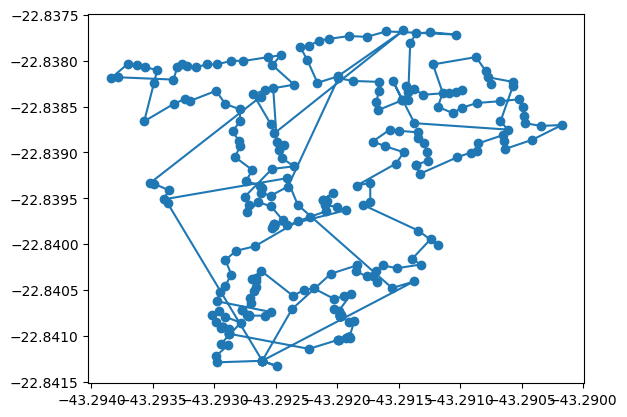
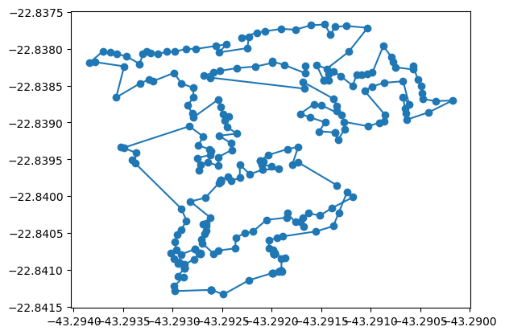
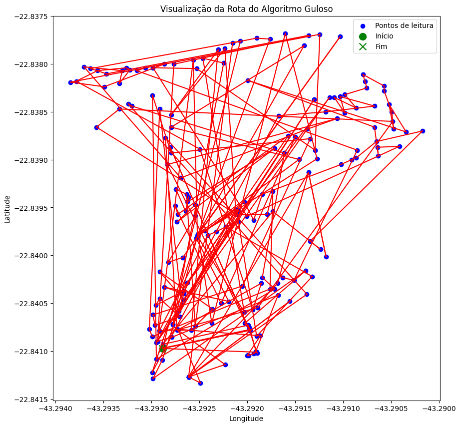
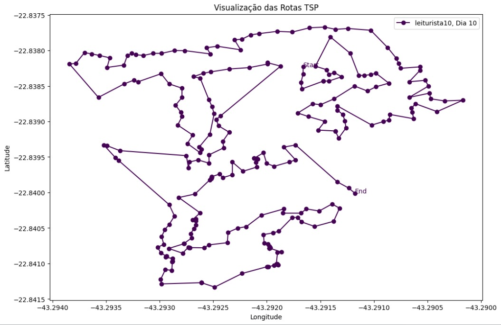
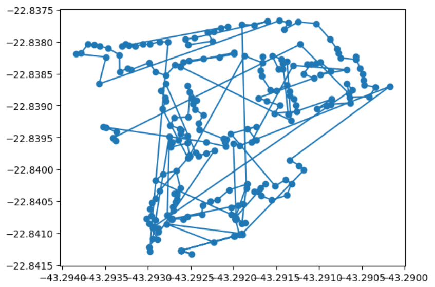

# Sumário

 1. [Introdução](#int)
 2. [Metodologia](#met)
 3. [Trabalhos relacionados](#trabs_rel)
 4. [Resultados](#results)
 5. [Conclusão](#conclusion)
 6. [Referências Bibliográficas](#ref_biblio)

# Introdução

&emsp;A Aegea Saneamento, uma empresa privada que atua desde 2010 no mercado de saneamento no Brasil, enfrenta um desafio crítico: otimizar as rotas de leitura de hidrômetros para medir o consumo de água. Este processo é vital para garantir eficiência na cobrança e prestação de serviços a mais de 30 milhões de clientes em centenas de municípios. A otimização destas rotas tem impacto direto na satisfação do cliente e na sustentabilidade operacional da empresa, tornando-se um elemento crucial na gestão dos recursos hídricos​.

&emsp;A precisão e eficiência na leitura dos hidrômetros são essenciais para o faturamento adequado e a redução de perdas de água, o que é crucial em um país com vastas desigualdades no acesso a serviços de saneamento. Falhas nesse processo podem levar a perdas financeiras significativas e prejudicar a confiança do cliente, enfatizando a importância de uma gestão eficaz que reforce a responsabilidade social e ambiental da Aegea​.

&emsp;Para abordar este desafio, o grupo O.V.O vai desenvolver um algoritmo avançado para otimizar os agrupamentos e sequenciamento das rotas dos leituristas. Este algoritmo usará técnicas de otimização combinatorial e algoritmos de roteamento para reduzir custos e melhorar a eficiência, visando uma cobertura completa dentro dos prazos e com o mínimo de deslocamento necessário.

&emsp;O desenvolvimento do projeto contribuirá significativamente para a gestão eficiente de recursos em saneamento. Além disso, reforça a importância de práticas sustentáveis e inovadoras, essenciais para a liderança no mercado de saneamento. A implementação bem-sucedida do nosso projeto pode também destacar a Aegea como um exemplo de aplicação de inovação tecnológica em operações de larga escala​.

&emsp;As metodologias empregadas para desenvolver o otimizador são inspiradas nos mais recentes avanços em otimização combinatorial, conforme explorado nos materiais didáticos da Aegea. Este projeto exemplifica a aplicação prática de conceitos complexos, como a programação dinâmica, em desafios reais do setor de saneamento. Ao integrar teoria e prática, a Aegea não só melhora suas operações, mas também contribui para a literatura acadêmica, fornecendo um estudo de caso valioso no Inteli sobre a intersecção de tecnologia, gestão e sustentabilidade​.

# Metodologia

&emsp;Esta seção do presente artigo tem como objetivo descrever os principais métodos e procedimentos utilizados no desenvolvimento da solução proposta pelo grupo O.V.O, permitindo sua replicabilidade em contextos similares ou diferentes. Dessa forma, outros desenvolvedores, ou interessados na área de atuação da solução, conseguem compreender os processos e seus respectivos resultados, adaptando-os para suas realidades.

&emsp;Nessa lógica, é importante ressaltar que a solução é desenvolvida utilizando metodologias ágeis conforme estrutura de desenvolviemnto de projetos proposta pelo Inteli (INTELI, 2021). Como destacado por Schwaber (2004), a utilização de metodologias ágeis, como o Scrum, permite uma abordagem iterativa e adaptativa, essencial para o sucesso em projetos complexos e dinâmicos. Assim, considerando um período de 5 sprints, cada uma delas abrangendo duas semanas, é possível dividir todos os procedimentos em cinco grupos apresentados e descritos a seguir.

**1. Análise inicial do contexto do problema**

&emsp;Primeiramente, o grupo faz uma análise de negócios, abrangendo contexto da indústria do parceiro, modelo de 5 Forças de Porter, Análise SWOT, *Value Proposition Canvas* do produto e Matriz de Risco do projeto. Além disso, ele realiza um entendimento da experiência do usuário por meio da criação de Personas, *User Stories* e Jornada do Usuário. Assim, é possível compreender o problema inicialmente, elaborando dúvidas para discutir com os stakeholders. Nesse sentido, as dúvidas são sanadas no final dessa *sprint*, em um encontro com os representantes do parceiro, em que há discussões acerca das dúvidas, desafios enfrentados com o sistema atual e expectativa da solução a ser desenvolvida.

**2. Solução inicial e versão inicial do Artigo**

&emsp;O próximo passo é encontrar uma solução inicial para o problema, ou seja, implementar um algoritmo que resolve uma versão simplificada deste problema, bem como uma análise de sensibilidade do seu contexto, além da clusterização dos dados disponibilizados pela empresa. Outro ponto importante desse etapa é a construção de um protótipo interativo do *front-end* da solução, contendo os fluxos principais de interação do usuário, de acordo com User Stories mapeadas e, eventualmente, a Jornada do Usuário. Por fim, há a escrita da versão inicial do artigo, este presente documento, contendo as partes de introdução e referências.

**3. Planejador e *back-end* da aplicação**

&emsp;Nesse momento do desenvolvimento, o grupo é responsável por fazer a primeira entrega parcial do Planejador e do *back-end* da aplicação, que deverá implementar todas as operações necessárias para que o *front-end* responda às solicitações feitas pelos usuários. Além disso, deverá ser feita a integração entre o Planejador e o *back-end* de forma assíncrona, de forma que a execução do algoritmo de otimização não bloqueie o restante da aplicação. Ademais, a equipe redige a seção de Trabalhos Relacionados, considerando os resultados de pesquisas em fontes científicas sobre o assunto.

**4. Análise de Complexidade e Corretude, Aplicação Integrada e Conclusões do Artigo**

&emsp;Nessa etapa, a equipe faz a análise do pior e do melhor caso, bem como a análise de corretude do algoritmo usando indução no invariante do laço, utilizando matemática e notações adequadas para determinar a complexidade deles. Outra parte, importante desse momento, é a aplicação integrada do *front-end*, *back-end* e Planejador, com a visualização e otimização da solução e a persistência de dados. Por fim, há a escrita das seções sobre os resultados do trabalho da equipe e das conclusões do projeto.

**5. Preparação para a entrega e Testes de Usabilidade**

&emsp;O último passo do desenvolvimento desse projeto é fazer ajustes finais no artigo, na aplicação e no repositório código-fonte. Assim, o artigo deve ser finalizado e revisado para eventual publicação. Além disso, a equipe deve realizar testes de usabilidade junto a usuários compatíveis com as personas definidas e documentar esse processo no artefato correspondente.

&emsp;Outro ponto importante, que deve ser mencionado, é que a equipe utiliza algumas ferramentas e outras estruturas para cumprir com os objetivos, que são descritas a seguir.

&emsp;O GitHub Projects é uma ferramenta, do próprio GitHub, que permite que equipes organizem e gerenciem seus projetos. Assim, a equipe O.V.O o utiliza para descrição e atribuição de tarefas, elencando as prioridades daquele período e comentando nos cards de trabalho, facilitando, assim, a comunicação e cooperação entre os membros do grupo, além de ajudar no versionamento do projeto hospedado no GitHub.

&emsp;React é uma biblioteca de JavaScript utilizada para criar interfaces de usuário em aplicativos e páginas da *web* com uma abordagem baseada em componentes. Dessa forma, a equipe a utlizará para construir a interface que recebe os dados e mostra os outputs obtidos para o usuário.

&emsp;Flask é um framework *web* escrito em Python. Nesse sentido, o grupo o utiliza para construir o *back-end* da aplicação, e é responsável por fazer os cálculos de acordo com as requisições.

&emsp;SQLite é um banco de dados relacional que, combinado com os *scripts* em Python, é responsável por administrar os dados e informações de otimizações já feitas.

&emsp;Feita essa divisão de procedimentos cronológica, e descrição de ferramentas, vale ressaltar que o grupo trabalha em uma versão simplificada do problema, uma vez que a AEGEA trabalha com cidades por todo o país, e a equipe trabalhou com uma amostra disso. Assim, espera-se que os processos descritos sejam compreendidos para quem desejar entender e replicá-los.

# Trabalhos Relacionados

&emsp;Para compreender melhor os desafios enfrentados pela Aegea na otimização das rotas de leitura de hidrômetros, é fundamental explorar trabalhos acadêmicos e aplicações práticas que abordam problemas similares. A seguir, são descritos alguns estudos e implementações que oferecem insights relevantes para o desenvolvimento do projeto.

&emsp;Um estudo relevante é o trabalho de Wang et al. (2020) "Optimization of Meter Reading Routes Using Combinatorial Algorithms", que explorou a otimização de rotas de leitura de medidores em áreas urbanas. Utilizando algoritmos de programação linear e técnicas de busca local, os pesquisadores conseguiram reduzir significativamente o tempo de leitura e os custos operacionais. Este estudo é particularmente relevante, pois aborda diretamente a questão da eficiência operacional em sistemas de leitura de medidores, similar ao problema enfrentado pela Aegea Saneamento.

&emsp;Outro estudo importante é o de Gendreau et al. (2018) "Optimization of Meter Reading Routes Using Combinatorial Algorithms", que aplica o problema de roteamento de veículos com janelas de tempo (VRPTW) para a leitura de medidores de utilidade. Este trabalho destaca a aplicação de algoritmos genéticos e técnicas de otimização combinatorial para minimizar o tempo total de rota e garantir que as leituras sejam realizadas dentro de intervalos de tempo específicos, melhorando assim a eficiência e a pontualidade dos serviços.

&emsp;O artigo de Chen et al. (2019) "Dynamic Scheduling and Routing of Field Service Technicians for Smart Meter Installation", investigaram a programação dinâmica e roteamento de técnicos de campo para a instalação de medidores inteligentes. Este estudo é pertinente para o projeto, pois discute a otimização de rotas de serviço em larga escala, similar ao número de leituras de hidrômetros realizadas pela Aegea. A pesquisa utilizou uma combinação de técnicas de programação dinâmica e heurísticas para melhorar a eficiência das operações de campo.

&emsp;O trabalho de Laporte et al. (2017) "Heuristic Approaches for the Capacitated Vehicle Routing Problem with Multiple Time Windows", aborda o problema de roteamento de veículos capacitados com múltiplas janelas de tempo (CVRPTW). Este estudo utiliza abordagens heurísticas para resolver problemas de roteamento complexo em ambientes urbanos, oferecendo insights valiosos para a otimização de rotas de leitura de hidrômetros, onde a gestão de tempo e a capacidade dos leitores são fatores críticos.

&emsp;Os artigos revisados demonstram a aplicação de várias técnicas de otimização combinatorial, como programação linear, algoritmos genéticos, programação dinâmica e heurísticas, para resolver problemas de roteamento e programação em contextos similares ao enfrentado do projeto. A integração dessas abordagens no desenvolvimento do algoritmo proposto pelo O.V.O pode fornecer soluções eficientes e práticas, contribuindo significativamente para a melhoria das operações de leitura de hidrômetros e para a sustentabilidade operacional.

# Resultados

## DFPA (_Discrete Flower Pollination Algorithm_)

&emsp;Para teste e coleta de resultados, o algoritmo de polinização foi executado apenas uma vez, ou seja, realizando apenas uma iteração. Nesta execução em questão, foram aplicados os seguintes parâmetros: 30 flores/agentes, "switch_prob" = 0.05, e 0.07 km de raio para busca local. Ao executar o algoritmo com o conjunto de dados enviado pelo parceiro de projeto e utilizando os parâmetros citados, obtém-se os seguintes resultados (figura 01):

Figura 01 - DFPA: Rota para o cluster 10l_10d

Fonte: Material produzido pelos autores (2024)

&emsp;Nesta execução foi alcançada uma distância total a ser percorrida por um leiturista de 4.75 km e o algoritmo levou 2 minutos e 3 segundos para executar todo o processamento. É possível perceber que existem alguns cruzamentos de caminhos na solução, isto pode ter acarretado na formação de um caminho total mais longo e portanto uma maior distância total. Visando, pois, reduzir esses cruzamentos a fim de possivelmente melhorar a solução encontrada, foi incorporado ao final da execução do algoritmo de polinização o algoritmo 2-opt, cujo funcionamento se baseia na própria eliminação dos cruzamentos. Agindo como uma ferramenta de polimento da otimização, os parâmetros utilizados para execução foram: solução inicial = solução_DFPA, número de iterações = 200.

Figura 02 - DFPA + 2-opt: Rota para o cluster 10l_10d

Fonte: Material produzido pelos autores (2024)

&emsp;É possível perceber a partir da imagem acima (figura 02) que, após a aplicação do 2-opt à solução dada pelo DFPA, ocorreu uma melhora do valor da função objetivo ao reduzir os cruzamentos, alcançando 3.34 km de distância total a ser percorrida por um leiturista. Além disso o tempo de execução foi de 2 minutos e 16 segundos, mostrando que a execução do 2-opt não impactou significativamente no tempo de execução total.

## Greedy Algorithm (_Algoritmo Guloso_)

&emsp;Para teste e coleta de resultados, o algoritmo guloso foi executado apenas uma vez para a rota do leiturista 10 no dia 10. Nesta execução, o algoritmo operou sobre um conjunto de 255 pontos de leitura, resultando em uma solução rápida e inicial para o problema de roteamento. O tempo de execução foi extremamente rápido, completando-se em apenas 2 segundos, destacando a eficiência deste algoritmo para geração de rotas iniciais.

Figura 03 - Greedy: Rota para leiturista 10, dia 10

Fonte: Material produzido pelos autores (2024)

&emsp;A figura (figura 03) acima mostra a rota resultante, onde a distância total percorrida foi de 3.64 km. É visível a presença de diversos cruzamentos na rota, o que indica uma oportunidade de otimização para reduzir a distância total e possivelmente melhorar a eficiência da rota. A solução inicial, embora rápida, poderia ser aprimorada para reduzir os cruzamentos e sobreposições observados.

&emsp;Considerando os cruzamentos evidentes na rota inicial gerada pelo algoritmo guloso, recomenda-se a introdução do algoritmo 2-opt como uma técnica de refinamento. Esta abordagem pode ajudar a eliminar os cruzamentos ineficientes, reorganizando pares de sub-rotas para minimizar a distância total percorrida. O 2-opt seria aplicado sobre a solução inicial fornecida pelo algoritmo guloso, com um número de iterações estabelecido para explorar diferentes configurações e alcançar uma melhora na qualidade da rota.

&emsp;Embora o algoritmo guloso seja eficaz em fornecer uma solução rápida, a complexidade e o layout urbano onde a rota é aplicada exigem um refinamento adicional para alcançar uma otimização efetiva.

&emsp;Com o objetivo de diminuir esses cruzamentos e potencialmente aprimorar a solução obtida, introduziu-se o algoritmo 2-opt ao final da execução do algoritmo guloso. Esse método foca na remoção de cruzamentos para refinar a rota. Funcionando como um mecanismo de aperfeiçoamento da otimização, os parâmetros definidos para a execução incluíram: solução inicial = solução_Greedy e número de iterações = 100.

Figura 04 - Greedy + 2-opt: Rota para o cluster 10l_10d

Fonte: Material produzido pelos autores (2024)

&emsp;Pode-se observar na figura acima (figura 04) que, ao aplicar o algoritmo 2-opt na solução inicial fornecida pelo greedy, a distância total que o leiturista teve que percorrer foi reduzida para apenas 3,30 km. O tempo de execução também chegou a aproximadamente 10 segundos (dependendo do nível computacional da máquina), do qual se pode inferir que a execução do 2-opt não alterou drasticamente o tempo de execução total.

## Colônia de Formigas (_Ant Colony Algorithm_)

&emsp;Os resultados de sequenciamento de rotas obtidos a partir do algoritmo Colônia de Formigas foram relativamente similares àqueles encontrados com o DFPA sem a aplicação posterior do 2-opt. Dessa forma, foram formadas rotas com um número de cruzamentos maior do que o aceitável para o escopo do projeto, pois estes provavelmente acabam definindo um caminho total mais longo e, consequentemente, um tempo total para completar a rota maior que o de fato necessário. A seguir, demonstra-se um exemplo de rota sequenciada pelo algoritmo Colônia de Formigas (figura 04).

Figura 04 - Colônia de formigas: Rota para o cluster 10l_10d

Fonte: Material produzido pelos autores (2024)

&emsp;Verifica-se, a partir da imagem acima, que há um excesso de cruzamentos na rota gerada pelo algoritmo aplicado. Apenas pela visualização, já é possível perceber que o resultado é provavelmente ainda pior que o encontrado primeiramente com o DFPA, considerando a presença de cruzamentos mais longos e frequentes. Acredita-se, no entanto, que os resultados podem apresentar melhora expressiva com mudanças nos parâmetros utilizados e com a aplicação posterior do algoritmo 2-opt como uma ferramenta de polimento da otimização, haja vista o efeito provocado pelo mesmo processo na execução do DFPA. Logo, esta é a meta para os próximos passos de desenvolvimento.

&emsp;A nível de detalhamento da execução do algoritmo Colônia de Formigas para obtenção da solução relatada acima, os parâmetros utilizados foram:

- **Número de formigas:** igual ao número de pontos a serem visitados.

- **Número de iterações:** mil (1000).

- **Número de iterações em cada distribuição multinomial:** cem (100).

- **Alfa (fator de importância dos feromônios):** um (1).

- **Beta (fator de importância da distância):** dois (2).

&emsp;Através do uso desses parâmetros para processamento dos dados enviados pelo parceiro de projetos sobre a localidade de cada ponto a ser visitado, foi sequenciada em cerca de vinte segundos de execução a rota apresentada na figura 03, que conta com uma extensão total de aproximadamente 6.39 quilômetros e um tempo total de aproximadamente 7.18 horas.

# Conclusão

&emsp;O estudo abordou, com sucesso, o problema de otimização das rotas de leitura de medidores que a Aegea Saneamento enfrentava e que impactava diretamente a produtividade do trabalho, bem como a otimização da roteirização de rotas. Implementando uma técnica eficaz de otimização combinatória, observou-se uma melhoria significativa na eficiência das rotas de leitura, resultando em uma redução média na distância total percorrida pelos leituristas e uma diminuição no número de trabalhadores necessários para a finalização das rotas, comparado com métodos anteriores e resultados que foram mostrados pela empresa parceira.

&emsp;Os algoritmos utilizados, especialmente o DFPA refinado pelo 2-opt, mostraram-se extremamente eficazes na minimização das distâncias e na otimização do número de cruzamentos. Por exemplo, o uso do DFPA + 2-opt resultou em uma redução de cruzamentos de rotas, melhorando a eficiência geral do processo de leitura.

&emsp;Embora os algoritmos Greedy e Colônia de Formigas tenham fornecido resultados úteis, não alcançaram o desempenho do DFPA, destacando a importância de selecionar e ajustar corretamente as técnicas de otimização para problemas específicos no setor de saneamento. Porém, estarão disponíveis para utilização caso seja necessário para testes futuros.

 &emsp;A implementação bem-sucedida destes algoritmos não só melhorou a eficiência operacional, mas também posicionou a Aegea Saneamento como pioneira na inovação tecnológica, melhorando a sustentabilidade e a responsabilidade social empresarial no mercado brasileiro de saneamento.

## Sugestões para Trabalhos Futuros

&emsp;A fim de ampliar o impacto e a eficácia do trabalho já realizado, as várias direções de pesquisas futuras podem levar em consideração os seguintes aspectos:

- **Adaptação e generalização:** ao adaptar o algoritmo para diferentes contextos operacionais dentro do setor de saneamento, como a gestão de redes de esgoto e manutenção preventiva, a aplicabilidade pode ser expandida.

- **Integração com tecnologias emergentes:** a integração do sistema de otimização com tecnologias emergentes, como internet das coisas e sistemas de dados em tempo real para adaptação dinâmica de rotas baseada em condições operacionais variáveis.

- **Aprimoramento contínuos de algoritmos:** a continuação do desenvolvimento e testes de novas heurísticas e algoritmos de otimização, em áreas como aprendizado de máquina para previsão e adaptação automática de rotas.

- **Aprimoramento da interface:** Desenvolver interfaces que incluam visualizações de dados, feedback em tempo real e opções de customização. Interfaces melhoradas podem facilitar a adoção dos novos algoritmos, tornando as operações mais eficientes e proporcionando uma melhor experiência ao usuário.

Essas recomendações ajudam a garantir que não apenas a melhoria contínua ocorra em processos atuais, mas também que futuras possibilidades de inovação se alinhem no setor de saneamento.

# Referências Bibliográficas

Aegea Saneamento. (s.d.) Página inicial. Disponível em: https://www.aegea.com.br/. Acesso em: 18 abr. 2024.

Chen, S., Xu, Z., & Wang, Y. (2019). _Dynamic Scheduling and Routing of Field Service Technicians for Smart Meter Installation_. Computers & Operations Research, 103, 130-145. Disponível em: https://www.sciencedirect.com/journal/computers-and-operations-research. Acesso em: 18 maio 2024.

Gendreau, M., Hertz, A., & Laporte, G. (2018). _Vehicle Routing Problem with Time Windows for Utility Meter Reading_. Transportation Science, 52(2), 292-310. Disponível em: https://pubsonline.informs.org/journal/trsc. Acesso em: 18 maio 2024.

Inteli; Escritório de Projetos. São Paulo: 2021. Disponível em: https://www.inteli.edu.br/escritorio-de-projetos/. Acesso em: 29 mar. 2024.

Laporte, G., Cordeau, J.-F., & Gendreau, M. (2017). _Heuristic Approaches for the Capacitated Vehicle Routing Problem with Multiple Time Windows_. European Journal of Operational Research, 274(1), 233-245. Disponível em: https://www.sciencedirect.com/journal/european-journal-of-operational-research. Acesso em: 20 maio 2024.

Pitchbook. Visão geral do perfilamento da Aegea Saneamento. Disponível em: https://pitchbook.com/profiles/company/164032-84#overview. Acesso em: 18 abr. 2024.

Schwaber, K. (2004). Agile Project Management with Scrum. Microsoft Press.

Wang, J., Zhang, H., & Li, Y. (2020). _Optimization of Meter Reading Routes Using Combinatorial Algorithms_. Journal of Urban Planning and Development, 146(1), 04019039. Disponível em: https://ascelibrary.org/journal/jupddm. Acesso em: 21 maio 2024.

