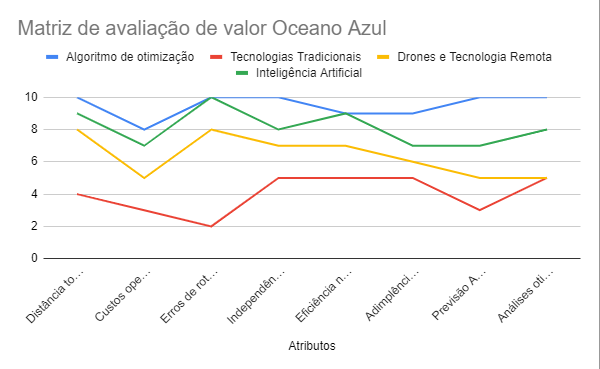
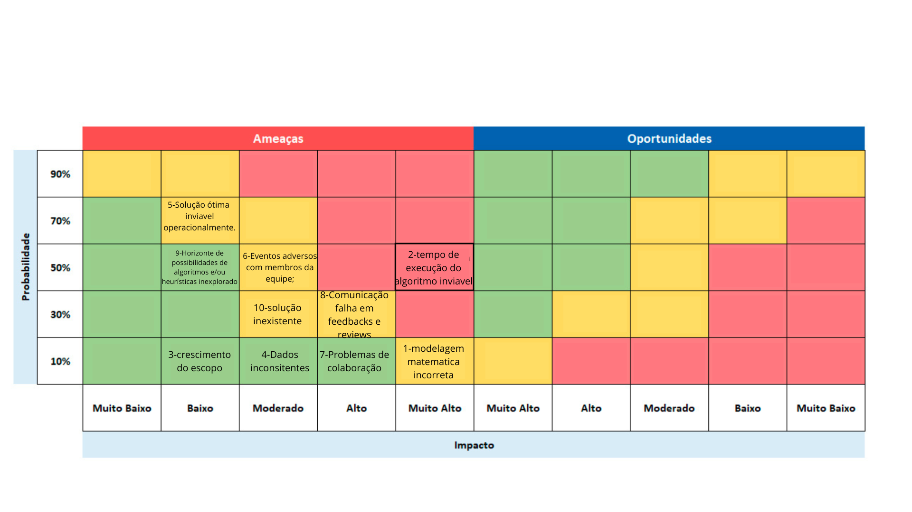
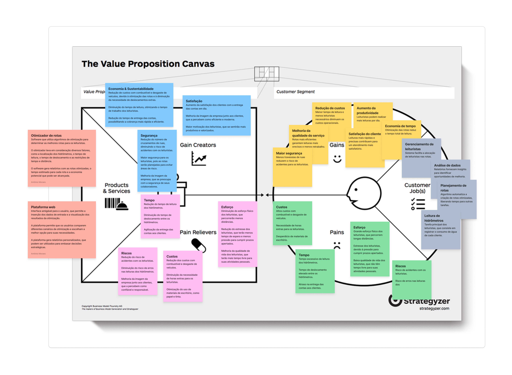

# Entendimento de negócio

## 1. Contextualização da indústria

&emsp;A Aegea Saneamento é uma empresa brasileira que atua no setor de saneamento básico. Criada em 2010, possui uma presença influente e ampla no mercado brasileiro, e é reconhecida como uma das maiores operadoras privadas de saneamento do país. Sua atuação abrange diversas regiões do Brasil, nas quais oferece serviços de abastecimento de água, coleta e tratamento de esgoto, além de outras soluções relacionadas ao saneamento.

&emsp;De forma mais abrangente, o mercado de saneamento básico no Brasil passou recentemente por mudanças significativas, especialmente após a aprovação do novo marco regulatório em 2020. A entrada de empresas privadas, como a Aegea Saneamento, tem sido fundamental para impulsionar investimentos no setor e melhorar a qualidade dos serviços oferecidos à população. Além disso, a crescente conscientização sobre a importância do saneamento básico para a saúde pública e o meio ambiente atualmente gera demanda por soluções inovadoras e sustentáveis, colocando empresas como a Aegea em destaque conforme materializam aprimoramentos em seus processos operacionais nesse sentido.

&emsp;Nesse contexto, a Aegea Saneamento investe frequentemente na diversificação suas operações e na incorporação de práticas sustentáveis em suas atividades, além da melhora constante no oferecimento de seus serviços aos clientes. Isso inclui investimentos em tecnologias avançadas para o tratamento de água e esgoto e em otimização de seus processos através dos recursos tecnológicos, como é possível notar a partir da proposta de desenvolvimento do projeto em questão. Ademais, a empresa também promove programas de conscientização ambiental e eficiência energética e busca parcerias com governos locais e outras entidades para favorecer o acesso universal aos serviços de saneamento, contribuindo para o desenvolvimento socioeconômico das comunidades em que atua.

&emsp;Apesar do progresso alcançado, a Aegea Saneamento enfrenta desafios expressivos no mercado, incluindo a necessidade de expandir sua infraestrutura para atender a uma demanda crescente, especialmente em regiões menos desenvolvidas do país, e a perpetuação de práticas obsoletas nas operações da empresa, como na roterização da leiturização de hidrômetros, tema central do projeto em desenvolvimento. A fim de sanar esses problemas, a empresa adota estratégias como a procura por novas oportunidades de negócios e parcerias, principalmente governamentais, a otimização de processos operacionais e o investimento em inovação tecnológica.

&emsp;Em contrapartida, o mercado de saneamento básico não apresenta um nível de competitividade muito acirrado, mas sim empresas já estabelecidas e com locais de atuação bem determinados há longos períodos de tempo. A Aegea Saneamento, sendo uma empresa relativamente nova no ramo, enfrentou bastante e ainda precisa encarar a dificuldade de negociações de acordos, principalmente com órgãos públicos, para poder expandir sua área de ação e aumentar tanto seu faturamento quanto o oferecimento de seus serviços no cenário nacional. Entretanto, a empresa obteve sucesso em conquistar sua parcela de mercado e se manteve em crescimento nos últimos anos, pois tenta se adaptar às conjunturas socioeconômicas e tecnológicas atuais e investe no aprimoramento constante dos seus serviços a fim de atender às demandas dos clientes.

&emsp;Ademais, a Aegea reafirma seu compromisso com práticas sustentáveis e uma visão de longo prazo para o desenvolvimento do setor de saneamento básico no Brasil, visando a construção de um futuro com harmonia entre progresso e conservação ambiental e com acesso mais amplo aos serviços de saneamento. Com o cumprimento de normas ambientais rigorosas, a promoção da eficiência no uso de recursos naturais e o investimento em projetos sociais que beneficiam as comunidades atendidas pela empresa, essa abordagem sustentável não apenas fortalece a reputação da Aegea, mas também contribui para o crescimento saudável e sustentável do país como um todo, considerando a atuação em diversos pontos do território nacional.

&emsp;Em suma, a Aegea Saneamento é uma empresa líder no mercado brasileiro de saneamento básico, que cresceu desde a aprovação do último marco regulatório em 2020 e tem sido pauta recorrente em discussões e ações políticas, dada sua relevância para a qualidade de vida e saúde sanitária da população. Dessa forma, sendo comprometida com a inovação, sustentabilidade e prestação de serviços de alta qualidade à população, é válido afirmar que o papel exercido pela empresa é fundamental para impulsionar o desenvolvimento socioeconômico do país e melhorar a qualidade de vida das comunidades em que atua.

## 2. Matriz de avaliação de valor Oceano Azul

&emsp;A aplicação da Matriz Oceano Azul, destaca uma mudança estratégica no mercado com a otimização das rotas de leitura de hidrômetros. Este projeto foca no desenvolvimento de um algoritmo que melhora a eficiência operacional e a adimplência dos clientes. Integrando fatores como tempo de leitura e velocidade dos leituristas, o algoritmo ajusta as rotas para melhorar a gestão de recursos e atender a uma demanda por serviços de saneamento eficientes, impactando positivamente a sustentabilidade e o bem-estar social. Com isso, a Aegea busca não só se diferenciar da concorrência, mas também estabelecer novos padrões para o setor.

&emsp;A imagem a seguir apresenta a Matriz Oceano Azul, ilustrando o desempenho do algoritmo de otimização em comparação com outros métodos do mercado.

Figura 01 - Matriz de avaliação de valor Oceano Azul

Fonte: Material produzido pelos autores (2024)

&emsp;Após a imagem, a avaliação detalhada oferece *insights* sobre como cada método de otimização é classificado em diferentes atributos, esclarecendo as vantagens do algoritmo da Aegea frente aos concorrentes.

### 2.1. Concorrentes de Métodos de Otimização de Rotas

   - **Tecnologias Tradicionais**: Empresas que utilizam tecnologias tradicionais muitas vezes se apoiam em *softwares* de gestão de rotas que são menos sofisticados ou até mesmo em planejamento manual. Esses métodos podem não incorporar dados em tempo real ou análises avançadas, o que pode resultar em rotas menos eficientes e maior consumo de tempo e recursos.
 
   - **Sistemas de Informação Geográfica (GIS)**: GIS utiliza dados geoespaciais para planejar rotas, o que permite a análise de variáveis como topografia, condições do tráfego e padrões climáticos para otimizar o trajeto. Isso ajuda na criação de rotas mais eficientes, reduzindo o tempo de viagem e os custos associados, especialmente em operações de grande escala que dependem de logística precisa.

   - **Uso de Drones e Tecnologia Remota**: Drones são empregados para realizar leituras aéreas de hidrômetros em áreas de difícil acesso, como regiões montanhosas ou densamente urbanizadas onde o acesso terrestre é complicado. Isso não só melhora a eficiência da coleta de dados mas também reduz o risco e o tempo necessário para realizar essas tarefas.

   - **Inteligência Artificial e Aprendizado de Máquina**: A IA e o aprendizado de máquina são utilizados para otimizar rotas de leitura de hidrômetros, analisando grandes volumes de dados históricos para detectar padrões e otimizar continuamente as rotas. Essas tecnologias permitem adaptações em tempo real às mudanças nas condições de tráfego ou outros fatores externos, melhorando significativamente a eficiência e a precisão das operações.

### 2.2. Reduzir

**Distância Total Percorrida**:

   - **Algoritmo de Otimização (10/10)**: Os algoritmos de otimização são projetados para calcular a rota mais eficiente, minimizando a distância total percorrida. Eles utilizam métodos matemáticos complexos, como programação linear e algoritmos genéricos, para encontrar a melhor combinação de rotas possíveis dentro de um conjunto de restrições pré-definidas.

   - **Tecnologias Tradicionais (4/10)**: As tecnologias mais antigas e tradicionais geralmente dependem de planejamento manual ou de sistemas mais básicos de gestão que não integram dados em tempo real ou análises complexas, resultando em rotas menos eficientes e maior distância percorrida.

   -  **Drones e Tecnologia Remota (8/10)**: Drones e outras tecnologias remotas podem reduzir significativamente a necessidade de deslocamento humano, especialmente em áreas de difícil acesso. No entanto, podem não ser capazes de considerar todas as variáveis como um algoritmo de otimização faria, resultando em eficiência um pouco menor que o ideal.

   - **Inteligência Artificial (9/10)**:A IA, especialmente quando integrada com aprendizado de máquina, pode otimizar rotas de forma muito eficiente, aprendendo continuamente com os dados para melhorar as recomendações de rotas. No entanto, sem ser parte de um sistema de otimização dedicado, pode não alcançar a máxima eficiência possível.

**Custos Operacionais**:

   - **Algoritmo de Otimização (8/10)**: Embora otimize as rotas para serem as mais curtas e rápidas, o desenvolvimento e a manutenção de tais sistemas de algoritmos de otimização podem ser caros, envolvendo tecnologia avançada e necessidade de atualizações constantes.

   - **Tecnologias Tradicionais (3/10)**: Devido à sua natureza menos eficiente e a dependência de processos manuais ou sistemas básicos, essas tecnologias tendem a incorrer em custos operacionais mais elevados devido a uma gestão ineficiente de rotas e recursos.

   - **Drones e Tecnologia Remota (5/10)**: Embora ofereçam potencial para redução de custos ao diminuir a necessidade de deslocamentos físicos, os custos iniciais de implementação e manutenção de drones e tecnologias remotas podem ser significativos, equilibrando o benefício potencial.
   
   - **Inteligência Artificial (7/10)**: A IA pode oferecer economias significativas ao longo do tempo ao otimizar continuamente as rotas com base em novos dados e padrões de tráfego. No entanto, os custos de desenvolvimento e integração de sistemas de IA robustos podem ser substanciais inicialmente.

### 2.3. Eliminar

**Erros de roteirização**:

   -  **Algoritmo de Otimização (10/10)**: Utilizando técnicas avançadas de matemática e computação, esses algoritmos minimizam erros de roteirização ao ajustar continuamente as rotas com base em variáveis complexas e dados em tempo real. Sua alta precisão deve-se à capacidade de processar e integrar múltiplos dados e condições operacionais de forma eficaz.

   -  **Tecnologias Tradicionais (2/10)**: Baseadas em métodos mais manuais ou sistemas simplificados, essas tecnologias apresentam uma maior taxa de erros. A falta de integração com dados em tempo real e a menor capacidade de análise complexa contribuem para uma eficiência reduzida e maior propensão a falhas na roteirização.

   - **Drones e Tecnologia Remota (8/10)**: Enquanto drones e tecnologias remotas proporcionam melhor precisão em terrenos complexos e áreas de difícil acesso, eles ainda enfrentam limitações técnicas que podem resultar em erros. Ainda assim, a tecnologia avançada empregada reduz significativamente a margem de erro em comparação com métodos mais tradicionais.

   - **Inteligência Artificial (10/10)**: A IA, especialmente quando combinada com aprendizado de máquina, destaca-se na minimização de erros de roteirização ao aprender continuamente com os dados coletados e ajustar as rotas em tempo real. Esta capacidade de autoaprendizagem e adaptação torna a IA extremamente eficiente na prevenção de erros.

**Independência de Reajustes Frequentes**: 

   - **Algoritmo de Otimização (10/10)**: Por serem altamente eficientes e auto-suficientes, esses algoritmos requerem poucos reajustes após sua implementação inicial. Eles são projetados para operar de forma autônoma, adaptando-se às mudanças sem necessidade de intervenção constante.

   - **Tecnologias Tradicionais (5/10)**: Estas tecnologias demandam reajustes mais frequentes devido à sua menor capacidade de adaptação automática a novas informações ou mudanças operacionais, resultando em uma necessidade contínua de supervisão e ajuste manual.

   - **Drones e Tecnologia Remota (7/10)**: Embora ofereçam alguma flexibilidade e adaptação a condições variadas, drones e tecnologias remotas não alcançam a completa autonomia que os algoritmos de otimização dedicados oferecem. Eles podem necessitar de ajustes periódicos para alinhar-se às melhores práticas ou mudanças ambientais.

   - **Inteligência Artificial (8/10)**: A IA possui uma excelente capacidade de adaptação, mas pode requerer ajustes ocasionais para refinar seus algoritmos ou atualizar seus modelos baseados em aprendizado contínuo. Embora sejam autônomos na maioria das vezes, esses ajustes são essenciais para manter a eficácia a longo prazo.

### 2.4. Aumentar

**Eficiência na Conclusão das Rotas**:

   - **Algoritmo de Otimização (9/10)**: Algoritmos de otimização são altamente eficazes na maximização da eficiência das rotas, quase atingindo a perfeição. Eles calculam as rotas mais eficientes utilizando modelos avançados que consideram múltiplas variáveis e restrições, mas sempre há espaço para pequenas melhorias através de ajustes e atualizações baseadas em novos dados ou tecnologias emergentes.

   - **Tecnologias Tradicionais (5/10)**: Estas tecnologias oferecem um nível mediano de eficiência, muitas vezes dependendo de métodos manuais ou de sistemas básicos que não são dinâmicos ou adaptativos. A falta de integração de dados em tempo real e capacidades analíticas limitadas resulta na necessidade de aprimoramentos contínuos para manter a relevância e eficácia.

   - **Drones e Tecnologia Remota (7/10)**: Os drones e outras tecnologias remotas são bastante eficazes em áreas específicas, como monitoramento e inspeção de infraestruturas ou áreas de difícil acesso. No entanto, eles não abrangem todas as necessidades operacionais e podem não ser ideais para todos os tipos de rotas, especialmente aquelas que requerem interações complexas ou entregas detalhadas.

   - **Inteligência Artificial (9/10)**: A inteligência artificial é extremamente eficiente na otimização de rotas devido à sua capacidade de aprender e melhorar continuamente. A IA pode ajustar rotas em tempo real, aprender com padrões de tráfego e prever obstáculos, resultando em rotas altamente eficazes e reduzindo atrasos.

**Adimplência dos Clientes**:

   - **Algoritmo de Otimização (9/10)**: Além de melhorar a eficiência das rotas, os algoritmos de otimização também contribuem significativamente para a adimplência dos clientes. Eles garantem que os processos sejam mais rápidos e precisos, reduzindo o tempo de espera dos clientes e aumentando a satisfação, o que frequentemente leva a uma melhor taxa de pagamento.

   - **Tecnologias Tradicionais (5/10)**: Com eficiência limitada, essas tecnologias têm pouco ou nenhum impacto direto na adimplência dos clientes. O atraso nas entregas ou serviços pode resultar em insatisfação e, consequentemente, em atrasos nos pagamentos.

   - **Drones e Tecnologia Remota (6/10)**: Embora os drones possam melhorar a eficiência em certos aspectos operacionais, eles não são o principal fator que influencia a adimplência. No entanto, a rapidez e a inovação que eles trazem podem contribuir positivamente para a satisfação do cliente, o que pode, por sua vez, melhorar a adimplência em alguns casos.

   - **Inteligência Artificial (7/10)**: A IA pode ter um impacto positivo na adimplência dos clientes através de previsões precisas e personalização das interações com o cliente. Ao otimizar rotas e prever as necessidades dos clientes, a IA ajuda a garantir que os serviços sejam entregues de maneira oportuna e precisa, melhorando a experiência do cliente e potencialmente aumentando as taxas de pagamento.

### 2.5. Criar

**Previsão Avançada para Manutenção e Intervenções**

   - **Algoritmo de Otimização (10/10)**: Algoritmos de otimização são extremamente eficazes na previsão de manutenção e planejamento de intervenções, utilizando dados operacionais otimizados. Eles permitem a realização de manutenções proativas, reduzindo significativamente o tempo de inatividade. Isso é possível graças à análise preditiva avançada que antecipa problemas antes que eles ocorram, permitindo intervenções precisas e bem planejadas.

   - **Tecnologias Tradicionais (3/10)**: Com capacidades limitadas de análise, as tecnologias tradicionais muitas vezes carecem das ferramentas necessárias para prever a manutenção de forma eficaz. Essas tecnologias podem depender mais de manutenções reativas, onde as ações são tomadas após a ocorrência de falhas, o que é menos eficiente e pode resultar em maiores períodos de inatividade.

   - **Drones e Tecnologia Remota (5/10)**: Os drones e tecnologias remotas oferecem algum potencial para previsão de manutenção através da observação remota. Eles podem ser utilizados para inspecionar infraestruturas e equipamentos, identificando problemas que não seriam facilmente visíveis de outra forma. No entanto, essas tecnologias ainda não estão plenamente integradas aos sistemas de previsão de manutenção, o que limita seu potencial total.

   - **Inteligência Artificial (7/10)**: A IA, com sua capacidade de aprender e adaptar-se a partir de grandes volumes de dados, é bastante eficaz na previsão de manutenção. Ela pode analisar padrões históricos e condições operacionais para prever falhas e necessidades de manutenção, permitindo que as empresas se antecipem a problemas potenciais e planejem intervenções mais eficazes.

**Análises Otimizadas para Gestão de Recursos Hídricos**

   - **Algoritmo de Otimização (10/10)**: Na gestão de recursos hídricos, os algoritmos de otimização são capazes de fornecer *insights* extremamente detalhados e precisos. Eles analisam grandes quantidades de dados ambientais e operacionais para otimizar o uso e a distribuição de recursos hídricos, contribuindo para uma gestão mais sustentável e eficiente.

   - **Tecnologias Tradicionais (5/10)**: Com uma capacidade limitada de processar dados complexos e realizar análises avançadas, as tecnologias tradicionais muitas vezes só conseguem fornecer uma visão básica da gestão de recursos hídricos. Isso pode resultar em uma gestão menos eficaz e menos adaptativa às necessidades e variações ambientais.

   - **Drones e Tecnologia Remota (5/10)**: Embora úteis para coletar dados geográficos e ambientais em locais remotos ou de difícil acesso, os drones não são especificamente projetados para gestão de recursos hídricos. Eles podem contribuir com dados valiosos, mas a análise e integração desses dados em estratégias de gestão ainda são limitadas.

   - **Inteligência Artificial (8/10)**: A IA oferece análises avançadas que podem transformar significativamente a gestão de recursos hídricos. Embora não seja tão focada quanto um algoritmo de otimização específico para essa finalidade, a IA ainda é capaz de analisar grandes volumes de dados ambientais e operacionais para prever tendências e otimizar o uso de recursos.

## 3. Matriz de Risco

&emsp;Com a matriz de  risco desenvolvida, consegue-se mapear os riscos envolvidos durante o desenvolvimento do projeto. Ela consiste em uma matriz retangular, contendo no eixo vertical uma marcação de o quão provável que um risco mapeado se torne realidade, no eixo horizontal temos um indicativo do impacto daquele risco, podendo ser muito baixo, até muito alto de maneira que impacte drasticamente o andamento do projeto. Além disso, ela apresenta em seu lado direito, uma matriz espelhada que mapeia as oportunidades relacionadas ao projeto. Vale ressaltar que a coloração dos campos indicam a gravidade de cada possibilidade, no caso do risco, ou o valor da oportunidade no caso das oportunidades.

&emsp;Abaixo se encontra a matriz de risco desenvolvida pela equipe e a explicação de cada risco mapeado na sequência:

Figura 02 - Matriz de Risco

Fonte: Material produzido pelos autores (2024)

- **Risco 1 - Modelagem matemática incorreta:** Devido à complexidade do problema abordado, ou a um mau entendimento do contexto da Aegea, pode-se formular o modelo com menos restrições do que o necessário, ou até mesmo errar na modelagem da função objetivo.

    - **Tipo - Muito alto com 10% de chance:** Por conta do escopo bem definido pelo parceiro e a clareza em expressar o objetivo do projeto a modelagem se torna algo mais objetivo e simples de visualizar, mas caso algum fator na  função objetivo ou restrições sejam adicionadas de maneira incorreta isto pode acarretar em outputs irreais e inconsistentes.

    - **Abordagem:** Prevenir.

    - **Ação:** Revisar a modelagem e confirmar em *reviews* qualquer alteração efetuada.

- **Risco 2 - Tempo de execução do algoritmo inviável:** Devido ao tamanho do problema (número de leituras) ou abordagem ao problema escolhida pode-se levar um tempo muito grande para a otimização, sendo inviável a utilização da solução na operação da Aegea. 

    - **Tipo - Muito alto com 50% de chance:** Devido ao tamanho do problema é provavel que o input seja grande demais para algumas abordagens e seu impacto é muito alto, pois caso a abordagem escolhida pela equipe não execute em tempo viavel precisaremos mudar a nossa abordagem.

    - **Abordagem:** Previnir.

    - **Ação:** Realizar testes com os dados oferecidos pelo parceiro e buscar orientação com professores.

- **Risco 3 - Crescimento do escopo:** Devido à complexidade do problema apresentado e suas nuances o grupo pode vir a escolher adicionar uma feature que aumente a complexidade da solução e não caiba dentro do período do módulo.

    - **Tipo - Baixo com 10% de chance:** devido à possibilidade de controle da equipe quanto aos problemas que resolverá, a probabilidade de um crescimento de escopo é baixa, mas caso ocorra pode significar um desvio de foco do que realmente seria necessário.

    - **Abordagem:** Previnir.

    - **Ação:** Realizar testes com os dados oferecidos pelo parceiro e buscar orientação com professor.

- **Risco 4 - Dados inconsitentes:** É possivel que a medida que recebamos mais dados, estes podem vir com inconsistencias.
 
    - **Tipo - Moderado com 10% de chance:** A probabilidade é baixa, pois o parceiro apresentou uma estrutura de dados coerente, mas caso novos dados venham de forma inconsistente isto pode acarretar em algum atraso, sendo assim um risco de impacto moderado.

    - **Abordagem:** Mitigar/Tercerizar.

    - **Ação:** Redirecionar algum membro ocioso para analise destes dados e entrar em contato com o orientador para relatar o caso.

- **Risco 5 - Solução ótima inviável operacionalmente:** Por mais que o algoritmo desenvolvido encontre uma solução ótima, esta pode ser inviável de ser colocada em pratica devido à nuances que a realidade das operações da Aegea trazem consigo.

    - **Tipo - Baixo com 70% de chance:** A chance de o algoritmo entregar uma solução inviável não é baixa pois um modelo não consegue comportar toda realidade em si, devido a isso podem haver aspectos que não foram levados em conta, mas poderiam ser deixados para uma pós otimização sendo assim o impacto seria baixo.

    - **Abordagem:** Previnir.

    - **Ação:** Realizar perguntas ao parceiro e solicitar feedbacks quanto aos outputs atingidos e consultar orientador e professores quanto às dúvidas pertinentes.

- **Risco 6 - Eventos adversos com membros da equipe:** Ao decorrer do projeto pode ser que alguns membros venham a adoecer, ou algum imprevisto ocorra.

    - **Tipo - Moderado com 50% de chance:** A chance de algum membro adoecer ou ter algum imprevisto é maior que a de termos uma solução inexistente, mas tem impacto iguald devido à necessidade de redirecionamento de trabalho.

    **Abordagem:** Mitigar.

    **Ação:** Realocar o fluxo de trabalho para suprir a falta.

- **Risco 7 - Problemas de colaboração:** Durante o desenvolvimento do projeto há a possibilidade que algum membro não realize suas atividades e não cumpra com suas responsabilidades.

    - **Tipo - Alto com 10% de chance:** A probabilidade é baixa devido ào perfil da equipe, mas caso ocorra o trabalho será atrasado e também será necessaria a ação de terceiros.

    - **Abordagem:** Tercerizar/Mitigar.

    - **Ação:** Ter um diálogo com a equipe e tercerizar para orientador em ultimo caso.

- **Risco 8 - Comunicação falha em feedbacks e reviews:** No decorrer das reviews é possivel que a equipe não consiga passar de maneira clara o que foi desenvolvido e as suas duvidas ao parceiro.

    - **Tipo - Alto com 30% de chance:** A probablidade é baixa devido à proatividade do parceiro, mas caso ocorra pode ser que o projeto atrase uma *sprint* sendo assim o impacto é alto.

    - **Abordagem:** Previnir.

    - **Ação:** Preparar a apresentação com cuidade e solicitar por feedbacks do parceiro quanto à clareza do que foi apresentado, além disso pode-se preparar perguntas de maneira antecipada para serem feitas na apresentação.

- **Risco 9 - Horizonte de possibilidades de algoritmos e/ou heurísticas inexplorado:** Dado o problema e a gama de trabalhos relacionados com o tema de roterização e suas inumeras possibilidades tanto de otimização quanto de modelagem, muito provavelmente haverá campos inexplorados pela equipe que poderiam oferecer um resultado melhor do que foi achado.

    - **Tipo - Baixo com 50% de chance:** a possibilidade é 50% pois é muito provavel que não se irá explorar tudo, mas o seu impacto é baixo pois isto não afetaria a equipe de produzir uma solução boa e viável.

    - **Abordagem:** Previnir.

    - **Ação:** Realizar uma pesquisa exploratoria sobre o tema de roterização e sobre as abordagens de otimização relacionadas e validar com professores quais são viáveis para o projeto.

- **Risco 10 - Solução inexistente:** A partir da modelagem matemática é possivel que  devido a um conjunto de restrições incompativeis o algoritmo não encontre nenhuma solução que satisfaça os critérios requeridos.

    - **Tipo - Moderado com 30% de chance:** a possibilidade é um pouco baixa, pois o parceiro apresentou um conjunto de restrições baixo e coerentes, mas caso ocorra terá impacto moderado pelo retrabalho que será necessário.

    - **Abordagem:** Mitigar/Previnir.

    - **Ação:** Revisar rigorosamente as restrições modeladas para encontrar inconsistencias antes da modelagem, caso ocorra mesmo assim a inexistência de uma solução será necessário procurar algum professor e refazer a modelagem.

## 4. Canvas Proposta de Valor

&emsp;O Canvas de Proposta de Valor é uma ferramenta de gestão estratégica que permite visualizar e analisar os principais elementos que compõem a proposta de valor de um produto ou serviço. Segundo Alexander Osterwalder, autor do livro "Business Model Generation", o Canvas de Proposta de Valor é uma ferramenta essencial para o desenvolvimento de modelos de negócio inovadores e eficazes, pois ajuda a identificar as necessidades dos clientes e a criar soluções que atendam a essas necessidades de forma única e diferenciada. No contexto do projeto, o Canvas de Proposta de Valor foi utilizado para definir e comunicar claramente como a solução proposta agrega valor aos clientes e se diferencia da concorrência. A seguir, são apresentados os nove blocos que compõem o Canvas de Proposta de Valor, com uma breve descrição de cada um:

Figura 03 - Canvas de Proposta de Valor

Fonte: Material produzido pelos autores (2024)

&emsp;Com o Canvas de Proposta de Valor desenvolvido, foi possível identificar os principais benefícios e diferenciais da solução proposta, bem como as necessidades e desejos dos clientes que ela visa atender. A partir disso, foi possível alinhar a estratégia de produto com as expectativas dos usuários e do mercado, garantindo que a solução seja relevante, competitiva e sustentável a longo prazo.

## 5. Análise Financeira

&emsp;A análise financeira é essencial para garantir a viabilidade e sucesso do projeto. Esta seção demonstra a projeção de custos e receitas, fornecendo uma base sólida para o planejamento financeiro do projeto. Ao identificar e alocar recursos de maneira estratégica, podemos maximizar a eficácia do projeto enquanto minimizamos riscos financeiros. Abaixo, apresentamos um panorama do investimento total previsto, a distribuição dos recursos pelas diversas fases do projeto, a estimativa dos custos operacionais, projeções futuras de custos e receitas, além de uma metodologia robusta para as estimativas financeiras.

### 5.1. Investimento Total Previsto:

&emsp;O montante total de investimento para o projeto foi estabelecido em R$ 150.000. Este valor será destinado às diferentes fases do projeto, refletindo uma distribuição estratégica baseada em experiências prévias e na importância de cada etapa para o sucesso do projeto.

### 5.2. Distribuição do Investimento por Fase:

&emsp;Definição do Problema (R$ 20.000): Esta etapa define o escopo e os objetivos do projeto. Investir aqui assegura que todos os esforços subsequentes sejam direcionados a resolver questões que realmente impactam a operação da empresa. Este é o alicerce sobre o qual todas as outras fases são construídas.

&emsp;Coleta de Dados (R$ 30.000): A coleta de dados é crucial para garantir que a modelagem e a análise sejam baseadas em informações precisas e relevantes. Este investimento permite capturar um panorama amplo e detalhado da situação atual, facilitando uma modelagem mais acurada.

&emsp;Modelagem (R$ 40.000): A maior parcela do investimento, refletindo sua centralidade no projeto de pesquisa operacional. Aqui, os dados são transformados em modelos matemáticos ou simulações que preveem o comportamento operacional. Este processo é essencial para identificar soluções viáveis e inovadoras.

&emsp;Validação do Modelo (R$ 20.000): Validar o modelo com dados reais assegura que ele funcione conforme esperado em condições práticas. Este passo é crucial para ganhar confiança nas projeções e nas recomendações propostas pelo modelo.

&emsp;Implementação da Solução (R$ 30.000): O montante destinado a esta fase destaca sua importância para traduzir as soluções modeladas em ações concretas que geram melhorias tangíveis nas operações da empresa. Este é o ponto onde o projeto alcança seu objetivo final e começa a oferecer retorno sobre o investimento.

&emsp;Integrante do Grupo (R$ 10.000): Este valor é dedicado aos membros do grupo de projeto, garantindo que tenham os recursos necessários para executar suas tarefas eficientemente, cobrindo gastos operacionais adicionais individuais.

### 5.3. Custos Operacionais:

&emsp;Os custos operacionais estão previstos em R$ 6.000 mensais, totalizando R$ 72.000 anualmente. Adicionalmente, há custos de R$ 7.000 mensais por pessoa envolvida, necessários para cobrir despesas com transporte, comunicação e outras necessidades logísticas. O total anual desses custos adicionais deverá ser calculado com base no número de pessoas envolvidas ao longo do mês. Será crucial documentar a composição detalhada desses custos e as estratégias para otimização, visando a redução de despesas e a maximização da eficiência operacional.

### 5.4. Projeções de Custos e Receitas:

&emsp;As estimativas de custos incluem os investimentos nas fases do projeto e os custos operacionais, totalizando um valor significativo ao longo de um ano. Quanto às receitas, caso o projeto tenha o potencial para gerar retornos por meio de eficiências operacionais ou melhoria dos serviços, serão documentadas as expectativas de receita baseadas em dados históricos e benchmarks de mercado. Entretanto, se o projeto for interno e não visar vendas diretas, a projeção de receita não será necessária.

### 5.5. Metodologia para Estimativas Financeiras:

&emsp;A abordagem utilizada para estabelecer as estimativas financeiras baseia-se numa combinação de análises quantitativas e qualitativas. No aspecto quantitativo, considera-se modelos analíticos com o uso de fórmulas matemáticas e algoritmos para prever resultados com base em variáveis específicas. Além disso, simulações serão realizadas entre diferentes algoritmos para analisar os diversos fatores que podem influenciar os resultados de otimização. No aspecto qualitativo, avaliam-se premissas econômicas considerando condições econômicas gerais, como inflação e taxas de juros, que podem influenciar o desempenho financeiro do projeto. Modelos analíticos, análises de regressão e simulações são empregados, juntamente com uma avaliação cuidadosa das premissas econômicas e de mercado. Essa metodologia assegura que as estimativas sejam robustas e reflitam as oportunidades e desafios do projeto.

&emsp;Essas informações representam uma estimativa e estão sujeitas a ajustes conforme o projeto progride e novas informações são disponibilizadas.

## Referências

Aegea Saneamento. Portal digital da empresa. Aegea. Disponível em: https://www.aegea.com.br. Acesso em: 20 abr. 2024.

Governo Federal Brasileiro. Novo Marco Regulatório do Saneamento. gov.br. Disponível em: https://www.gov.br/ana/pt-br/assuntos/saneamento-basico/novo-marco-legal-do-saneamento. Acesso em: 24 abr. 2024.

STANKE, Bob. *Operations Research: Optimizing Decision-Making for Success — Helping Companies Deliver More Value Through Better Process Management*. Disponível em: https://www.bobstanke.com/blog/operations-research-overview. Acesso em: 25 abr. 2024.

MENDES, A. A Inteligência Artificial (IA) e otimização operacional nas empresas. Disponível em: <https://www.dtidigital.com.br/blog/a-inteligencia-artificial-ia-e-otimizacao-operacional-nas-empresas>. Acesso em: 25 abr. 2024.
