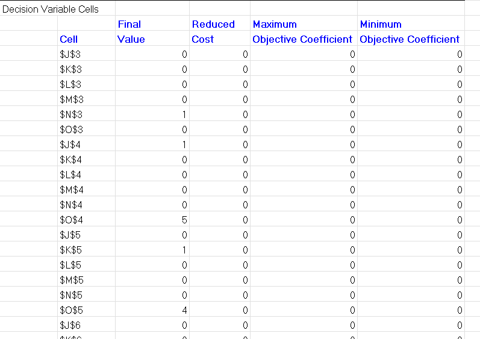
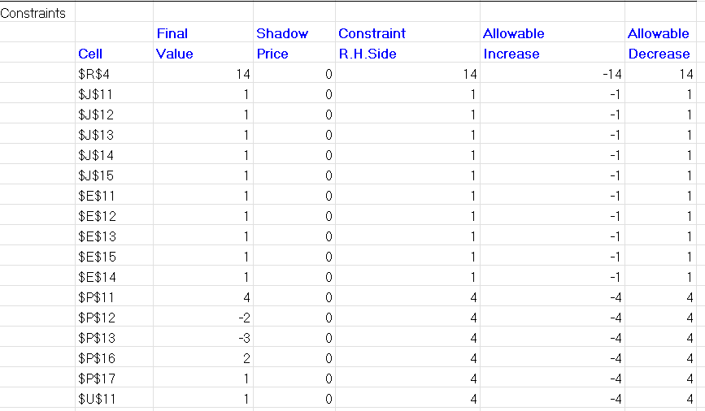

# Entendimento do Contexto do Problema

## Sumário

- [1. Contexto do projeto](#c1)
- [2. Definição do problema](#c2)
- [3. Definição de objetivos](#c3)
- [4. Recursos e Limitações](#c4)
- [5. Modelagem matemática](#c5)
    - [5.1. Caixeiro viajante clássico](#c51)
        - [5.1.1. Variáveis de decisão](#c511)
        - [5.1.2. Função objetivo](#c512)
    - [5.2. Restrições](#c52)
        - [5.2.1. Restrições do problema clássico](#c521)
        - [5.2.2. Restrições do projeto](#c522)
- [6. Análise de Sensibilidade](#c6)

## 1. Contexto do projeto

&emsp;A Aegea Saneamento enfrenta desafios significativos na otimização das rotas de leitura de hidrômetros, que são essenciais para o registro mensal do consumo de água de seus clientes. A leitura dos hidrômetros é uma atividade operacional crítica que impacta diretamente no faturamento e na adimplência dos clientes, e é realizada por leituristas que se deslocam a pé entre os endereços dos clientes, após um deslocamento inicial que pode incluir diversos modais de transporte. Esta operação precisa ser otimizada para melhorar a produtividade, eficiência e segurança dos leituristas.

&emsp;Tendo esse objetivo em vista, são necessários dados como a localização geográfica dos hidrômetros e a das rotas supramencionadas para o desenvolvimento de uma solução que aprimore esses processos operacionais da empresa. Dessa forma, o objetivo principal do projeto em questão é desenvolver um algoritmo que maximize o número de leituras efetuadas por rota dentro das restrições específicas do problema e do parceiro de negócios, promovendo uma operação mais eficiente e segura.

&emsp;Nesse contexto, as limitações mais significativas presentes na problemática em tratamento incluem a capacidade física dos leituristas, que afeta a quantidade de rotas que podem completar diariamente, e as restrições legais e de segurança, como a necessidade de minimizar a travessia de ruas para evitar acidentes. Além disso, a infraestrutura urbana e o acesso aos locais de leitura podem variar significativamente, influenciando a formação das rotas. Por último, há também restrições temporais, como tempo médio de leitura do hidrômetro, tempo de deslocamento de um endereço a outro, horas de trabalho diárias de cada leiturista e dias totais para finalização das leituras.

&emsp;A fim de formalizar esse problema e possibilitar sua modelagem em um sistema digital, expressões matemáticas e modelos de otimização serão desenvolvidos, considerando tanto funções objetivo que visem minimizar a distância total percorrida e o tempo total de leitura enquanto maximizam o número de hidrômetros lidos quanto as restrições anteriormente citadas, como tempo máximo de trabalho diário e a velocidade de deslocamento do leiturista, que serão expressas matematicamente para garantir a viabilidade das soluções propostas.

&emsp;Conforme as informações acima discutidas, o contexto do projeto engloba não apenas a necessidade operacional de otimizar as rotas de leitura, mas também a preparação e análise de dados relevantes, a definição clara de objetivos quantificáveis, a consideração de restrições operacionais e legais, e a formulação matemática dessas variáveis e restrições para o desenvolvimento do algoritmo de otimização, além da documentação adequada de todos esses processos. Logo, para fins de aprofundamento, são explorados detalhadamente nas seções a seguir a problemática enfrentada, os objetivos, os recursos, as limitações e a modelagem matemática do projeto em desenvolvimento.

##  2. Definição do Problema

&emsp;Como supracitado, a Aegea Saneamento, empresa parceira do projeto em desenvolvimento, opera o processo de leiturização de hidrômetros para registrar o consumo mensal de água de seus clientes, atividade crucial para o faturamento da empresa e, consequentemente, para a continuação e aprimoramento de seus serviços de saneamento e fornecimento de água. Entretanto, a quantidade de endereços de clientes atuais da empresa é bastante elevada: segundo ela, só na cidade do Rio de Janeiro, todo mês são lidas mais de um milhão e seiscentas mil ligações, sendo uma ligação o trecho entre dois pontos que compõe uma rota de leiturização, que por sua vez é composta por múltiplas ligações geralmente. Além disso, o tempo para completar a leitura de todos os trechos é de apenas vinte e dois dias no máximo, o que gera a necessidade de alocação de um número grande de leituristas para que a tarefa seja concluída a tempo, acarretando no aumento de custos para a Aegea.

&emsp;Em adição à análise anterior, há ainda um fator agravante para a empresa parceira: as rotas foram traçadas há anos manualmente e, por conseguinte, apresentam algumas falhas no que se refere à eficiência, com consideráveis ocorrências de cruzamento de caminhos e sem um processo de otimização computacional adequado e necessário, principalmente no cenário atual de modernização tecnológica do mercado. Ou seja, é urgente para a Aegea a adaptação às novas conjunturas no que tange a tecnologia a fim de maximizar a eficiência das operações da empresa, haja vista a desvantagem competitiva em que ela já se encontra dado que ainda opera com um modelo de rodas construído de forma arcaica e com expressivos pontos de melhoria.

&emsp;Ademais, é importante citar que a garantia de obtenção do volume de água consumido pelos clientes da Aegea Saneamento é diretamente relacionada à adimplência dos mesmos e ao faturamento da empresa, que possibilitam a oferta dos serviços de saneamento e distribuição de água. Dessa forma, nota-se a magnitude do impacto que a falta de eficiência nessa cadeia de leiturização tem, considerando sua imprescindibilidade no que diz respeito à lucro, entrega e prestação de contas por parte da Aegea. Logo, a necessidade pela modernização e aprimoramento desse processo torna-se ainda mais relevante.

&emsp;Portanto, define-se a problemática motivadora para o desenvolvimento do projeto em questão, em suma, sendo a otimização das rotas de leitura dos registros de consumo dos hidrômetros dos clientes da Aegea Saneamento, tanto a nível de definição dos endereços contidos em uma determinada rota quanto a sequência que deve ser seguida para realização da leitura em todos. Esse processo, por definição da proposta do projeto, deve ser concluído com o uso e adaptação de algoritmos clássicos para solução de problemas semelhantes, como o algoritmo Variante de *Branch-And-Bound* **¹**, utilizado para solucionar o famoso "Problema do Caixeiro-Viajante" **²**.

---

**1:** "O Algoritmo variante de Branch-And-Bound (B&B) é um modelo combinatório, pois ele se auxilia em outras técnicas para entregar uma solução final, estas são o Modelo Húngaro e o Branch-And-Bound." Disponível em: https://abepro.org.br/biblioteca/TN_STO_263_509_35790.pdf.

**2:**"[...] o Problema do Caixeiro-Viajante (PCV), esse que consiste em encontrar a melhor rota de entrega, saindo de um ponto específico, atendendo a todos os clientes e retornando ao ponto inicial." Disponível em: https://abepro.org.br/biblioteca/TN_STO_263_509_35790.pdf.

---

##  3. Definição de Objetivos

&emsp;Com o fito de mitigar os impactos para a Aegea da problemática apresentada anteriormente, propôs-se o desenvolvimento de uma aplicação tecnológica digital capaz de executar algoritmos para otimização das rotas de leiturização e demonstrar os resultados de seus processamentos via plataforma *web*, seguindo todas as restrições supracitadas para realização dos cálculos necessários. Assim, pretende-se agregar valor à empresa parceira a partir de um produto robusto e prático que siga esses princípios.

&emsp;Nesse contexto, os objetivos do projeto são definidos de maneira geral a seguir:
- Desenvolvimento de um otimizador de rotas que, a partir de dados de entrada, retorne qual a melhor configuração de agrupamentos e sequenciamento de endereços de clientes da empresa por meio de algoritmos de otimização, a fim de maximizar a eficiência no processo de leiturização e seus resultados;
- Construção de um *front-end* para acompanhamento visual dos resultados do otimizador, facilitando validação, comparação e adaptação;
- Tratamento e pré-processamento dos dados, visando a redução do tempo de execução dos algoritmos e do espaço de memória necessário, assim como a aplicação de medidas de segurança e filtragem das informações.
- Geração de *insights* de negócios para a empresa parceira através da manipulação de dados de entrada inseridos para execução do sistema, como número de leituristas disponíveis, horas trabalhadas diáriamente, dias totais para finalização das leituras, entre outros. Alterando essas variáveis, o usuário da plataforma pode comparar diferentes resultados e concluir qual o mais adequado de acordo com os recursos da Aegea Saneamento;
- Busca por performance computacional e aprimoramento do desempenho temporal e de uso de memória do sistema desenvolvido para oferecimento de uma solução de execução veloz e precisa para a empresa parceira.

&emsp;Ao cumprir com os pontos supracitados, procura-se materializar uma solução de excelência que atenda de forma plena as necessidades do parceiro de negócios e possa minimizar suas dores e prejuízos atuais decorrentes da problemática por ele apresentada. Considerando que a Aegea planeja continuar maximizando seu faturamento, expandindo seus horizontes como concessionária de saneamento e melhorando seu atendimento aos clientes, o valor agregado pelo desenvolvimento de um projeto com metas como as acima descritas é notório, pois as mesmas vão totalmente ao encontro do que a empresa espera como resultado para conclusão de seus próprios objetivos.

## 4. Recursos e Limitações
  
&emsp;Ao desenvolver o algoritmo de otimização para rotas de leitura de hidrômetros de consumo mensal para a AEGEA, é necessário considerar os recursos e limitações para garantir que as expressões matemáticas que representam a função objetivo e as restrições/limitações do problema sejam pertinentes.

&emsp;Restrição de Rota: todas as casas dos clientes devem ser visitadas em algum momento no período de entrada, ou seja, devem aparecer em alguma rota de sequenciamento. Essa limitação se dá por conta da própria função da empresa em ir na casa do ciente para ler o hidrômetro e, muitas vezes, entregar a conta também. Há um preferenciamento para a rota começar e terminar no mesmo lugar, o que caracteriza um problema de caxeiro viajante, mas essa parte não é uma restrição em si.

&emsp;Restrição de Atribuição de Leiturista Exclusiva: uma rota é atribuída a 1 único leiturista, uma vez que vai ser o trabalho dele visitar a rota naquele dia de trabalho e não há a necessidade de mais de 1 pessoa fazer isso.

&emsp;Restrição das variáveis: todas as casas devem ser visitadas em até um período de d dias, cada rota deve ter duração de até h horas por dia, em que o leiturista caminha com a velocidade v km/h e que a visita (tempo de leitura) dura m minutos. Essas são as variáveis de entrada para rodar o otimizador, como especificadas pela própria AEGEA, e que funcionam como restrições para a construção do modelo.

&emsp;Ao considerar todos esses pontos levantados, o algoritmo de otimização funciona de forma mais confiável e precisa, garantindo que os resultados obtidos sejam condizentes e satisfatórios.

## 5. Modelagem matemática

&emsp;Dado que este projeto gira em torno da roteirização de leituristas da Aegea, tem-se uma primeira impressão de que trataremos apenas de um problema do caixeiro viajante. Uma vez que será necessário visitar todas as ligações para coletar os dados. Porém, ao observar as restrições e nuances do problema, observa-se que não será apenas um caixeiro viajante simples. Neste caso, tem-se que, além de visitar todos os pontos, sair e voltar para a base, que pode ser uma ou múltiplas bases, ou até mesmo não voltar para as bases, mas obrigatoriamente sair delas.

&emsp;Além disso, tem-se um cenário onde será necessário mais de um "caixeiro", pois são mais de 500 leituristas. Sendo assim, não se trata de um caso clássico. De maneira geral, o objetivo deles, como citado anteriormente, é a maximização da produtividade das leituras. Tendo em vista que, uma vez otimizando a distância, consegue-se alocar mais pontos aos funcionários ou aumentar o tempo disponível dos leituristas para outras tarefas e, em último caso, reduzir a quantidade de leituristas.

&emsp;Ao observar esses detalhes, percebe-se que se tem algumas possibilidades para abordar o problema. É possível abordar um caixeiro viajante clássico para cada rota, ou modelar um caixeiro viajante múltiplo (mTSP), que dependendo das características adotadas, como múltiplas bases ou uma única, e até mesmo o retorno a essas bases ou não, pode apresentar resultados diferentes. De maneira geral, tem-se várias opções de abordagem e será interessante aquela que oferecer à Aegea melhores resultados quanto à distância percorrida, tempo de otimização e produtividade (quantidade de rotas por leiturista).

&emsp;Inicialmente, será abordada a formulação clássica do caixeiro viajante, levando em conta que se terá uma quantidade de pontos designada para cada leiturista e este terá que percorrê-la de maneira otimizada. Vale ressaltar que esta divisão de rotas será feita inicialmente com uma clusterização, buscando criar *clusters* de pontos para designar uma quantidade razoável de pontos para cada leiturista. Esta será apenas uma abordagem inicial para a divisão de rotas.

### 5.1. Caixeiro viajante clássico

&emsp;Este problema se trata de um caso clássico onde se tem uma quantidade de pontos $n$ que devem ser visitados uma única vez e, além disso, a distância para visitá-los deve ser mínima. Como se trata de um dos problemas elementares de caminho mínimo (ESPP - *Elementary Shortest Path Problem*) e também envolve caminhos hamiltonianos, geralmente este problema pode ser tratado utilizando grafos. O conjunto $V$ seria o conjunto de pontos a serem visitados e $E$ seria o conjunto de arestas ponderadas ou caminhos possíveis, com suas respectivas distâncias como peso.

#### 5.1.1. Variáveis de decisão

&emsp;Como se tem um problema relacionado à escolha de um caminho, a variável de decisão é binária. Assim, escolherá-se seguir ou não um determinado caminho entre nós. Portanto, podemos dizer que um $x$ entre $i$ e $j$ pode adotar um valor de 1 caso escolhido e 0 caso contrário.

$$ x_{ij} = \Bigl\\{ ^{ 1 \text{ se o caminho ij foi selecionado}} _{0 \text{ senão} } \Bigr\\}$$

#### 5.1.2. Função objetivo

&emsp;De maneira simples, a função objetivo adotada inicialmente ao problema é a distância percorrida para uma rota, onde $c$ é a distância entre o ponto $i$ e $j$. Neste caso, busca-se a melhor combinação de caminhos que forneça a rota de menor distância.

$$ min \space D = \sum_{i = 1 }^n\sum_{j\neq i , j=1}^n c_{ij}\cdot x_{ij} $$

### 5.2. Caixeiro viajante múltiplo (mTSP)

&emsp;Semelhante ao clássico, esta abordagem busca achar um caminho para cada um dos $m$ caixeiros, buscando minimizar a soma total do caminho de todos os caixeiros. Assim, cada caixeiro visitará uma única vez cada ponto não visitado e voltará à base.

#### 5.1.1. Variáveis de decisão

$$ x_{ij} = \Bigl\\{ ^{ 1 \text{ se o caminho ij foi selecionado}} _{0 \text{ senão} } \Bigr\\}$$

#### 5.1.2. Função objetivo

$$ min \space D = \sum_{i = 1 }^n\sum_{j\neq i , j=1}^n c_{ij}\cdot x_{ij} $$

### 5.3. Caixeiro viajante múltiplo com múltiplos depósitos (MDmTSP)

&emsp;Nesta variante do TSP, há um cenário onde se apresentam mais de um depósito ou base de saída possível e, além disso, tem-se $m$ caixeiros. Assim, como objetivo, além de minimizar a distância total, caracteriza-se pela seleção de saídas, ou seja, dispor as saídas das bases de forma que a distância total seja minimizada. Vale ressaltar que o caixeiro deverá voltar para a base da qual saiu.

&emsp;Na formulação deste problema, declara-se o conjunto de bases $B=\{1,2,3,...,b\}$, o conjunto de leituras $L=\{b+1,b+2,b+3,...,b+n\}$ e o conjunto de leituristas $L' = \{1,2,3,...,m\}$. Adota-se $C_ij$ como a distância entre um nó $i$ para um $j$, onde $i$ e $j$ podem ser pontos de leitura ou bases. 

#### 5.1.1. Variáveis de decisão

$$ x_{ijk} = \Bigl\\{ ^{ 1 \text{ se o leiturista k selecionar o caminho ij }} _{0 \text{ senão} } \Bigr\\}$$

#### 5.1.2. Função objetivo

$$ min \space D = \sum_{i = 1 }^{n+b}\sum_{j\neq i , j=1}^{n+b} \sum_{k=1}^m c_{ij}\cdot x_{ijk} $$

### 5.2. Restrições

&emsp;As restrições para o modelo podem variar em vários tipos como, por exemplo, restrições inerentes ao problema com que se está lidando, o problema do caixeiro viajante, em que giram em torno da passagem do caixeiro por todos os pontos. Além disso, existem restrições referentes ao projeto, nas quais cabem regras de negócio, e restrições da operação abordada no projeto que, neste caso, é o período de trabalho. Abaixo estão todas estas restrições de maneira matemática: 

#### 5.2.1. Restrições do problema clássico

$$ \sum_{i\neq j,i = 1 }^n  x_{ij} = 1  (\forall j \in \lbrace 1 , 2,...,n \rbrace)$$

$$ \sum_{j\neq i , j=1}^n  x_{ij} = 1  (\forall i \in \lbrace 1 , 2,...,n \rbrace)$$

&emsp;Restrição de subrotas: A partir das restrições acima, tem-se que todos os pontos devem ser visitados, mas não impedimos que subrotas sejam formadas. Estas subrotas acabam sendo escolhidas, pois a função objetiva sempre será menor, considerando que grafos desconexos do que um conexo. Para contornar este problema, existem duas abordagens principais que se encontram abaixo:

- *MTZ(Miller, Tucker e Zemlin)*

$$ u_i-u_j + nx_{ij} \leq n-1  (\forall i\neq 1 ,i \neq j  )$$    

- *DFJ(Dantzig, Fulkerson e Johnson)*
    
$$ \sum_{i \in Q }\sum_{j\in Q} x_{ij} \leq \vert Q\vert -1 (\forall Q \subseteq \lbrace 1 , 2,...,n \rbrace  \space e\space 2 \lt \vert Q \vert \leq n-1)$$

&emsp; Onde Q é o conjunto de subciclos. 

#### 5.2.1. Restrições do mTSP

$$ \sum_{i\neq j,i = 2 }^n  x_{ij} = 1  (\forall j \in \lbrace  2,...,n \rbrace)$$

$$ \sum_{j\neq i , j=2}^n  x_{ij} = 1  (\forall i \in \lbrace  2,...,n \rbrace)$$

$$ \sum_{j = 2 }^n  x_{1j} = m  $$

$$ \sum_{i=2}^n  x_{i1} = m  $$

&emsp;Restrição de subrotas: A partir das restrições acima, tem-se que todos os pontos devem ser visitados, mas não impedimos que subrotas sejam formadas. Estas subrotas acabam sendo escolhidas, pois a função objetiva sempre será menor, considerando que grafos desconexos do que um conexo. Para contornar este problema, existem duas abordagens principais que se encontram abaixo:

- *MTZ(Miller, Tucker e Zemlin)*

$$ u_i-u_j + (n-m)x_{ij} \leq n-m-1  (\forall i\neq 1 ,i \neq j  )$$    

&emsp; Onde m é o a quantidade de leituristas e n a  quantidade de pontos. 

- *DFJ(Dantzig, Fulkerson e Johnson)*
    
$$ \sum_{i \in Q }\sum_{j\in Q} x_{ij} \leq \vert Q\vert -1 (\forall Q \subseteq \lbrace 1 , 2,...,n \rbrace  \space e\space 2 \lt \vert Q \vert \leq n-1)$$

&emsp; Onde $Q$ é o conjunto de subciclos. 

#### 5.2.1. Restrições do MDmTSP

$$ \sum_{i \in B \cup L } \sum_{ k\in L`}  x_{ijk} = 1  (\forall j \in L;j \notin B)$$

$$ \sum_{j \in B \cup L } \sum_{ k\in L`}  x_{ijk} = 1  (\forall i \in L ;i \notin B)$$

$$ \sum_{j \in L}\sum_{ k\in L`}  x_{bjk} \leq m  (\forall b \in B)$$

$$ \sum_{ i\in L}\sum_{ k\in L`}  x_{ibk} \leq m  (\forall b \in B)$$

$$ \sum_{ i\in D} \sum_{ j\in L} \sum_{ k\in L`}  x_{ijk} = m  $$

$$ \sum_{ i\in L} \sum_{ j\in D}\sum_{ k\in L`}   x_{ijk} = m  $$

&emsp;Restrição de subrotas: A partir das restrições acima, tem-se que todos os pontos devem ser visitados, mas não impedimos que subrotas sejam formadas. Estas subrotas acabam sendo escolhidas, pois a função objetiva sempre será menor, considerando que grafos desconexos do que um conexo. Para contornar este problema, existem duas abordagens principais que se encontram abaixo:

- *DFJ(Dantzig, Fulkerson e Johnson)*
    
$$ \sum_{i \in Q }\sum_{j\in Q} x_{ij} \leq \vert Q\vert -1 (\forall Q \subseteq B \cup L \space e\space 2 \lt \vert Q \vert \leq n-1)$$

&emsp; Onde $Q$ é o conjunto de subciclos. 

#### 5.2.2. Restrições do projeto

&emsp;Restrição de tempo: Nesta restrição, levou-se em conta o tempo total que leva para o viajante ou, neste caso, o leiturista percorrer a rota. Nela, este tempo não pode ser maior que 132 horas, que é obtido levando em conta 22 dias de leitura e 6 horas por dia. No somatório (primeiro termo da inequação), encontra-se o tempo necessário para ir de um ponto a outro da rota. Já no segundo termo, sabendo que cada leitura dura 2 minutos e que se tem $n$ pontos, calcula-se o tempo total que o leiturista levará para efetuar a leitura em todos os pontos.

$$ \frac{\sum_{i = 1 }^n\sum_{j\neq i , j=1}^n c_{ij}\cdot x_{ij} }{velocidade} + \frac{2\cdot n}{60 min} \leq 22 dias \cdot 6 h/dia = 132h$$

&emsp;A partir de um contexto em que se leva em conta a clusterização, chega-se na restrição abaixo que funcionará apnenas para o *cluster* de dia, onde será executado o TSP. Nela, observa-se que a rota deve durar 6 horas ou menos. Se forem considerados os 22 dias, volta-se à restrição anterior que considera 132 horas mensais, mas a restrição abaixo é mais adequada para o problema atacado no momento.

$$ \frac{\sum_{i = 1 }^n\sum_{j\neq i , j=1}^n c_{ij}\cdot x_{ij} }{velocidade} + \frac{2\cdot n}{60 min} \leq  6 h $$

## 6. Análise de Sensibilidade

&emsp;A análise de sensibilidade, também conhecida como análise pós-otimização, pode ser usada para entender como as mudanças nos coeficientes da função objetivo e nas restrições afetam a solução ótima. Dessa forma, ela é aplicada após a solução ótima do problema já ter sido encontrada. Contudo, como ainda não foi elaborado um algoritmo para encontrar uma solução com todos os dados da AEGEA, será aplicada uma análise de sensibilidade em um conjunto menor de dados, utilizando o Solver do excel para encontrar a solução.

&emsp;Nesse sentido, foram escolhidos os 5 primeiros pontos da tabela AMOSTRA_TOTAL disponibilizada pela AEGEA para compor esse conjunto menor de dados. A seguir, as latitudes e longitudes desses pontos:

| **Ponto** | **Latitude** | **Longitude** |
| ----- | ----- | ----- |
| 1 | -22.858956 | -43.338632 |
| 2 | -22.830781 | -43.39501 |
| 3 | -22.821902 | -43.415018 |
| 4 | -22.834372 | -43.410329 |
| 5 | -22.86115 | -43.338667 |

&emsp;Assim, calculando a distância em km de cada ponto para outro, utilizando a fórmula de Haversine, que é uma importante equação usada em navegação, fornecendo distâncias entre dois pontos de uma esfera a partir de suas latitudes e longitudes, é construída a seguinte tabela *i* x *j* em que a interseção da linha *i* com a coluna *j* contém a distância entre o ponto *i* e o ponto *j*.

&emsp;Fórmula para cálculo da distância usando Haversine:

$${\displaystyle d=2r\arcsin \left({\sqrt {\sin ^{2}\left({{\varphi _{2}-\varphi _{1}} \over {2}}\right)+\cos(\varphi _{1})\cos(\varphi _{2})\sin ^{2}\left({{\lambda _{2}-\lambda _{1}} \over {2}}\right)}}\right)}$$

&emsp;Em que:
- *d* é a distância entre os dois pontos ao longo de um círculo máximo da esfera
- φ1, φ2 são a latitude do ponto 1 e a latitude do ponto 2 (em radianos)
- λ1, λ2 são a longitude do ponto 1 e longitude do ponto 2 (em radianos).

|   | **1** | **2** | **3** | **4** | **5** |
|---|-------|-------|-------|-------|-------|
|**1**| 0 | 6,57 | 8,85 | 7,84 | 0,24 |
|**2**| 6,57 | 0 | 2,28 | 1,62 | 6,69 |
|**3**| 8,85 | 2,28 | 0 | 1,47 | 8,96 |
|**4**| 7,84 | 1,62 | 1,47 | 0 | 7,92 |
|**5**| 0,24 | 6,69 | 8,96 | 7,92 | 0 |

&emsp;Com as distâncias calculadas, elas são colocadas em um arquivo Excel, que pode ser encontrado no mesmo diretório deste artefato, com a função objetivo e restrições do problema do caxeiro viajante clássico, bem como as variávies de decisão estabelecidas na seção anterior, para encontrar uma solução utilizando o Solver. Nesse sentido, para encontrar a melhor solução, são alterados os valores da tabela, quando *i* e *j* forem iguais, de 0 para 1000. Isso é feito para que o algoritmo não escolha essas rotas, que seriam mínimas por ser 0, mas que não são aplicáveis, uma vez que o objetivo é passar por todos os pontos de um para outro. Assim, otimizado o problema, é analizado o Relatório de Sensibilidade gerado e os resultados das seções de "Decision Variable Cells" e "Constraints".

&emsp;Na seção de "Decision Variable Cells" gerada no Relatório de Sensibilidade, é possível observar em até quanto cada variável de decisão pode aumentar ou diminuir na função objetivo para que a distância percorrida no caminho encontrado se mantenha a mesma. Dessa forma, percebe-se que nenhuma variável de decisão consegue aumentar ou diminuir sem que essa distância seja alterada, uma vez que todos os valores das colunas "Maximum Objective Coefficient" e "Minimum Objective Coefficient" são 0. Outro ponto importante, é que todos os valores da coluna "Reduced Cost" estão zerados, o que mostra que os coeficientes da função não deveriam ser modificados. Os valores finais das variáveis de decisão se encontram na coluna "Final Value".

  

Figura 01 - Relatório Decision Variable Cells

Fonte: Material produzido pelos autores (2024)

&emsp;Ademais, na seção de "Constraints", tem-se o "Shadow Price" que mostra quanto a função objetivo varia se aumentarmos 1 unidade no lado direito da inequação. Assim, como todos os valores são 0, o valor da função objetivo não se alteraria. Além disso, tem-se as colunas "Allowable Increase" e "Allowable Decrease" mostram o quanto o lado direito das restrições pode, repectivamente, aumentar ou diminuir, sem que seja necessário reotimizar o modelo, tendo como base para o cálculo da função objetivo a coluna "Shadow Price" citada. Diferentemente dela, essas colunas não estão zeradas, o que mostra que esses valores das restrições podem sofrer alterações. Já a coluna "Constraint R.H.Side" indica os valores do lado direito das restrições do modelo. Por fim, os valores finais de cada uma delas se encontram na coluna "Final Value".

  

Figura 02 - Relatório *Constraints*

Fonte: Material produzido pelos autores (2024)

  
&emsp;Assim, com todas essas mudanças analisadas, espera-se que o grupo seja capaz de tomar decisões informadas sobre possíveis ajustes no modelo, identificar áreas de potencial otimização e compreender a estabilidade da solução ótima em diferentes cenários, se tratando tanto de contextos menores, como o exemplo apresentado, quanto de contextos maiores com grandes quantidades de dados.

