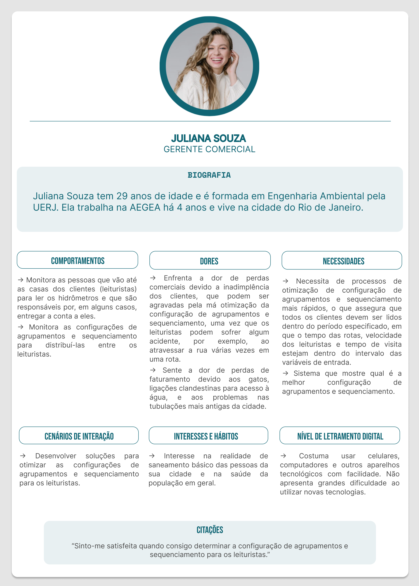
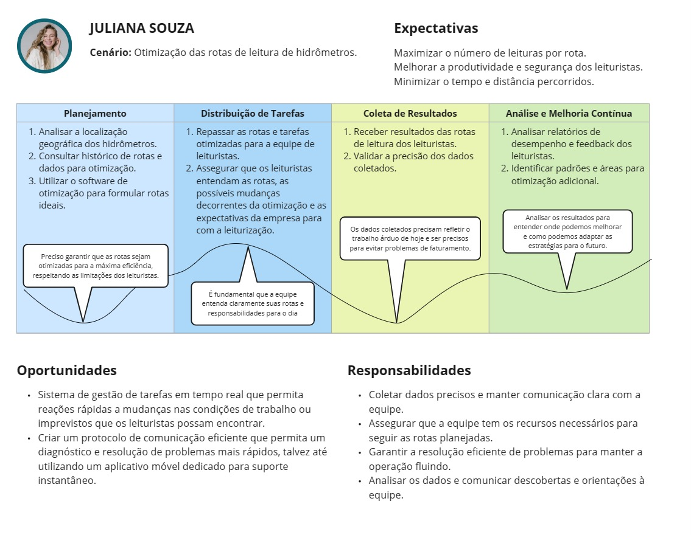

# Entendimento da Experiência do Usuário

## Sumário

[1. Personas](#c1)
[2. User Stories](#c2)
[3. Jornada do Usuário](#c3)
[Referências](#r)

## 1. Personas

&emsp;&emsp;As personas são representações fictícias dos perfis dos usuários que são criadas a partir da observação do comportamento deles, o que permite uma compreensão mais profunda e completa das necessidades do cliente, bem como suas dores, interações e outras características relevantes para o entendimento do usuário. Segundo Nielsen Norman Group, uma autoridade reconhecida em design de experiência do usuário, as personas são fundamentais para orientar as estratégias de negócio e garantir que os produtos oferecidos aos clientes atendam às expectativas. Quando se personificam as características e motivações dos usuários, as personas facilitam a criação de soluções mais relevantes e personalizadas para eles, promovendo maior engajamento e satisfação do cliente. Nesse sentido, foi desenvolvida uma persona para representar esses usuários da solução proposta, que é mostrada a seguir:

Figura 01 - Persona 01

Fonte: Material produzido pelos autores (2024)

&emsp;&emsp;Dessa forma, pode-se concluir que a construção da persona foi fundamental para determinar o cenário e as limitações da solução. Dentro deste cenário, a persona representa um ponto de atenção muito importante para o projeto, principalmente ao tornar evidente as prioridades dele, que são desenvolver uma solução que determine qual é a melhor configuração de agrupamentos e sequenciamento de acordo com as variáveis de entrada.

## 2. *User Stories*

&emsp;*User Stories* são ferramentas utilizadas no desenvolvimento de *softwares* para construir uma solução voltada para o usuário, orientando o processo para satisfazer as necessidades do cliente. Elas são constituídas por frases curtas que conseguem expressar as dores e necessidadeas do usuário de forma sucinta. Assim, ela tem como objetivo comunicar a visão do cliente para o time de desenvolvimento, o que promove um ambiente propício para um *brainstorming* mais eficiente e, consequentemente, consegue trazer soluções melhores.

&emsp;Nessa lógica, as *user stories* seguem o padrão: "Eu, como [algum usuário mapeado], quero [ação que usuário precisa/necessita fazer] para [benefício ou objetivo do usuário]." Além disso, elas são construídas considerando os aspectos do *INVEST*, que é acrônimo para *Independent* (Independente), *Negotiable* (Negociável), *Valuable* (Valiosa), *Estimable* (Estimável), *Small* (Pequena) e *Testable* (Testável). Assim, elas não podem depender de nenhuma outra *user storie* para ser implementada, podem aproveitar o capital intelectual de todo o time de desenvolvimento, precisam gerar valor para o usuário, têm que ser claras e pequenas, além de poderem ser testadas em toda a sua plenitude.

&emsp;Dessa forma, segue abaixo as *user stories* criadas focando no usuário final desse projeto. Elas representam as dores e anseios dos funcionários da área de gerência comercial da AEGEA.

Tabela 01 - *User Stories*

| **Número** | **Descrição**                        |
| ----- | ------------------------------------ | 
| US01 | Eu, como gerente comercial, quero utilizar o menor número possível de leituristas para minimzar o custo operacional da empresa.|
| US02 | Eu, como gerente comercial, quero visualizar todas as rotas que cada leiturista está fazendo para conferir se todos os clientes estão sendo visitados. |
| US03 | Eu, como gerente comercial, quero que os leituristas atravessem o menor número possível de ruas em suas rotas para que acidentes sejam evitados. |
| US04 | Eu, como gerente comercial, quero que os leituristas visitem todas as casas de sua rota para que as contas dos clientes, quando necessárias, sejam entregues. |
| US05 | Eu, como gerente comercial, quero que tenha o menor número de inadimplências para minimizar o prejuízo da empresa. |

Fonte: Material produzido pelos autores (2024)

&emsp;Nesse sentido, pode-se concluir que as *user stories* comunicam as necessidades e expectativas do usuário de forma clara e concisa para que o time de desenvolvimento consiga criar soluções que verdadeiramente resolvam os problemas apresentados. Assim, espera-se que a equipe de gerência comercial da AEGEA tenha seus anseios atendidos.

## 3. Mapa da Jornada do Usuário

&emsp;&emsp;O mapa da Jornada do Usuário contribui para alinhamentos do time e dos *stakeholders* acerca das rotinas de uso do produto por parte do público central, e norteia o desenvolvimento da solução em relação a interações necessárias para o sucesso do usuário na utilização do sistema desenvolvido. De acordo com Levi Olmstead (2024), o mapeamento da jornada do usuário ajuda a facilitar a adoção de produtos, fomenta o pensamento centrado no usuário e auxilia a identificar oportunidades de melhoria. A partir disso, foi desenvolvido o Mapa da Jornada do Usuário referente ao projeto em questão, que é apresentado a seguir:

Figura 02 - Mapa da Jornada do Usuário

Fonte: Material produzido pelos autores (2024)

&emsp;&emsp;Com o Mapa da Jornada do Usuário, desenvolvido com base nas informações coletadas durante a as entrevistas com o parceiro, conseguimos colocar o cliente no centro da estratégia de produto, fator fundamental para o sucesso do projeto.

## Referências

Nielsen Norman Group. Personas 101. NNgroup, 2024. 1 vídeo (4 min). Disponível em: https://www.nngroup.com/videos/personas-101/. Acesso em 23 abr. 2024.

OLMSTEAD, Levi. How to Create Customer & User Journey Maps (+Examples & Template). Whatfix, 2024. Disponível em: https://whatfix.com/blog/user-journey-mapping/. Acesso em 23 abr. 2024.

Bonilha, D. Como escrever as melhores *user stories* com *INVEST*. Adaptworks, Emphasys Group. 16 out. 2020. Disponível em https://blog.adapt.works/como-escrever-as-melhores-user-stories-com-invest/. Acesso em 25 abr. 2024.
