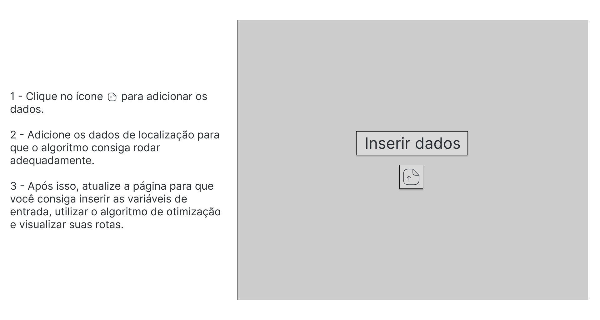
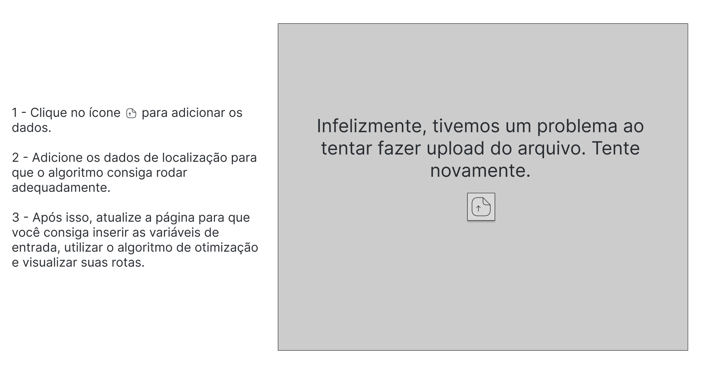
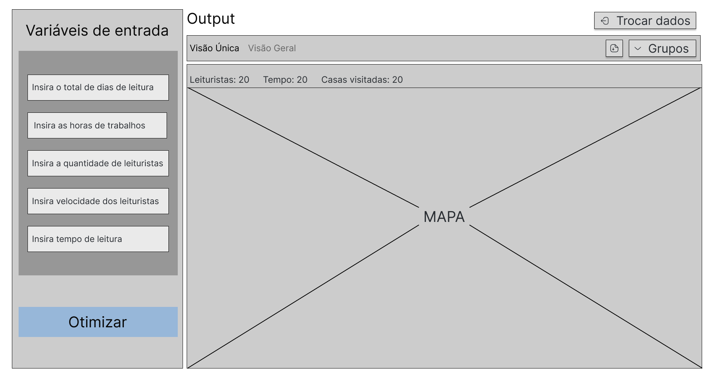
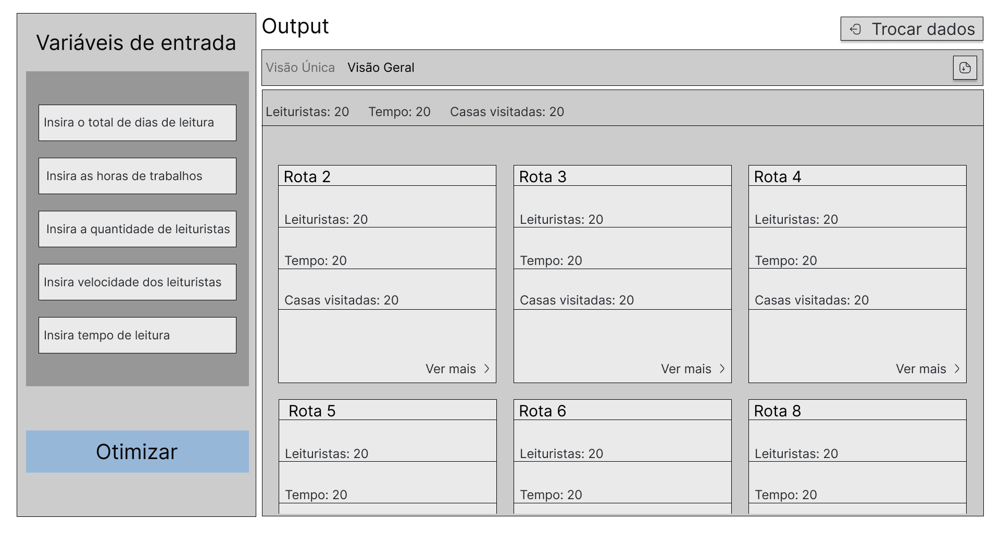

# Protótipo do front-end

## Sumário

[1. Wireframe](#c1)

## 1. Wireframe

&emsp;Wireframes são essenciais no desenvolvimento de projetos de software, particularmente em processos complexos como a otimização de rotas de leitura de hidrômetros pela Aegea Saneamento. Eles permitem uma visualização estruturada da solução, facilitando o alinhamento das expectativas entre os stakeholders e garantindo a correta compreensão e incorporação dos requisitos desde as fases iniciais. Através do wireframe, é possível visualizar claramente a disposição dos elementos do sistema, como variáveis de entrada e módulos de otimização, cruciais para a eficácia do algoritmo de roteirização.

&emsp;Além disso, o wireframe identifica desafios de usabilidade e interação, fundamentais para aprimorar a experiência dos leituristas que utilizarão o sistema em campo. Esta ferramenta também facilita a realização de ajustes antes da codificação, economizando tempo e recursos ao prevenir retrabalhos durante o desenvolvimento e testes. Assim, a prática de elaborar wireframes não é apenas uma etapa preliminar, mas uma atividade contínua e iterativa que contribui para o refinamento e sucesso do projeto, assegurando que a solução final seja funcional e esteja alinhada com as necessidades operacionais e estratégicas da empresa.

Figura 01 - Página inserir dados (*wireframe*) 

Fonte: Material produzido pelos autores (2024)

Figura 02 - Página com problema de dados (*wireframe*) 

Fonte: Material produzido pelos autores (2024)

Figura 03 - Página de Visão Única (*wireframe*) 

Fonte: Material produzido pelos autores (2024)

Figura 04 - Página Visão Geral (*wireframe*) 

Fonte: Material produzido pelos autores (2024)

### Página de Inserção de Dados
&emsp;A página de inserção de dados e o processo em três etapas descrito são importantes para garantir que todas as informações necessárias sejam inseridas corretamente antes da otimização. Este passo é vital para a integridade dos dados e para a eficácia do algoritmo de otimização.

&emsp;Estas decisões de design refletem uma abordagem centrada no usuário, garantindo que o software seja tanto funcional quanto intuitivo, permitindo ajustes flexíveis e fornecendo insights claros através da visualização dos dados. Isso tudo está alinhado com o objetivo do projeto de aumentar a eficiência operacional e a satisfação do cliente na Aegea Saneamento.

### Escolha das Variáveis de Entrada
&emsp;No wireframe, várias variáveis de entrada como "total de leituristas", "dias de leituras", "tempo de leitura", entre outras. Essas entradas são essenciais porque permitem que o algoritmo tenha os dados necessários para calcular as rotas mais eficientes, respeitando as restrições operacionais como o número de dias disponíveis para a leitura e a capacidade de trabalho dos leituristas. A flexibilidade na entrada desses dados permite ajustes dinâmicos ao planejamento das rotas, adaptando-se a variações no número de leituristas disponíveis ou alterações nas áreas de serviço.

### Botão de Otimização
&emsp;O botão "Otimizar" serve como um ponto de interação principal onde o usuário pode executar o algoritmo de otimização após inserir todas as variáveis necessárias. Esta função é fundamental, pois transforma os dados de entrada em soluções práticas de roteirização, refletindo a principal funcionalidade do software.

### Visualização de Rotas e Resultados
&emsp;As telas mostram diferentes abas para a visualização dos resultados, como "Visão Única" e "Visão Geral", permitindo aos usuários ver detalhes específicos de cada rota ou uma visão geral de todas as rotas otimizadas. Isso facilita a análise e comparação das rotas, ajudando a identificar as mais eficientes ou aquelas que precisam de ajustes.

### Mapa
&emsp;O mapa incluído na interface é um elemento visual crucial que ajuda os usuários a visualizar geograficamente as rotas planejadas. Isto é particularmente útil para entender como as rotas são distribuídas pela cidade ou região e para identificar padrões ou problemas, como rotas que cruzam frequentemente grandes vias, o que pode ser um risco para os leituristas.

&emsp;Para uma vizualização detalhada e interativa dos *wireframes*, acesse o protótipo completo no seguinte link no Figma:

https://www.figma.com/design/jIwUCqEXwOmUOWnXDFjkna/Untitled?node-id=0%3A1&t=FaJMv5nBgk2jl1Fd-1

### Iterações

&emsp;As interações, nesse protótipo inicial, foram construídas para tornar o caminho que o usuário faz na solução intuitivo para que o usuário consiga, sem maiores dificuldades, atingir seus objetivos de selecionar as variáveis de entrada, e conseguir visualizar as rotas construídas pelo algoritmo da solução. Dessa forma, já na página inicial de inserir dados, há um botão que redireciona para a página de "Visão Única", após a escolha dos dados utilizados, em que, inicialmente, não haverá nada até que o usuário coloque as variáveis de entrada desejadas e clique no botão de otimizar. É importante ressaltar que o usuário poderá ser redirecionado para a página de problemas de dados se a solução encontrar algum problema durante o *upload* do arquivo, mas poderá tentar adicioná-los novamente ao clicar no botão no centro da tela.

&emsp;O usuário, então, na página de visão única, coseguirá visualizar um mapa com todas as rotas selecionadas pelo algoritmo e escolher modo de visão de forma geral por meio da selação de "Visão Geral" na parte de cima da página. Além disso, conseguirá voltar para a página inicial por meio de um botão no canto superior direito, bem como escolher uma rota específica que o usuário queira analisar a partir da seleção desta rota no *dorpdown* de Rotas. Nesse sentido, no modo de "Visão Geral", todas as rotas vão aparecer em sub-blocos com suas características, em que o usuário poderá selecionar o botão de "ver mais" de cada rota para visualizá-la na página de visão única. 

&emsp;Ademais, o usuário será sempre capaz de alterar as variáveis de entrada, a qualquer momento, tanto na página de "Visão Geral" quanto na de "Visão Única", na parte esquerda das páginas, sendo necessário somente clicar no botão de "Otimizar" em seguida para o algoritmo selecionar as rotas. Além disso, ele é capaz de baixar um arquivo gerado com todas as informações de sequências das rotas e suas ligações, clicando no botão de baixar do lado do *dropdown* das rotas.

&emsp;Feitas essas iterações, espera-se que o usuário consiga navegar facilmente pelas telas e concluir suas tarefas de forma eficiente. A inclusão de recursos como o redirecionamento para a página de problemas de dados, a seleção de diferentes modos de visualização e a opção de alterar as variáveis a qualquer momento garantem uma experiência fluida e adaptável às necessidades do usuário. Portanto, o protótipo visa oferecer uma solução amigável, permitindo ao usuário explorar e analisar as rotas de forma eficaz e intuitiva.
