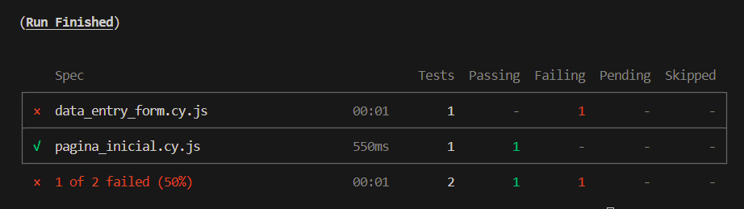

# Testes da Aplicação

## Cypress

&emsp;Cypress é uma ferramenta de teste de *front-end* avançada, construída para a *web* moderna. Ela permite que desenvolvedores e equipes de QA (*Quality Assurance*, ou garantia de qualidade) criem e executem testes automatizados para aplicações *web* de forma eficiente e com facilidade. Diferentemente de outras ferramentas de teste que operam por simular ações do usuário em um navegador, Cypress executa testes no mesmo ciclo de execução que a aplicação. Isso resulta em testes mais rápidos, confiáveis e que podem simular ações reais dos usuários com maior precisão. Cypress oferece suporte completo para todos os aspectos do teste moderno, incluindo testes de unidade, integração e *end-to-end*.

## Data_entry_form.cy.js

&emsp;Este é o teste *end-to-end*, cuja definição é de ponto a ponto. O teste automatizado navega até a URL do formulário, realiza o upload de um arquivo CSV e preenche diversos campos do formulário, como "dias de leitura", "horas por dia", "quantidade de leituristas" e "tempo de leitura". Além disso, seleciona uma opção em um menu dropdown para o algoritmo utilizado e submete o formulário. O erro ocorreu devido a um problema de integração do *backend* com o *front-end*, mas, assim que a integração for corrigida, o teste funcionará perfeitamente.

## Resultados de Teste:
- Falha na Submissão do Formulário: O teste identificou falhas na integração, resultando em erro ao tentar submeter o formulário. Isso ocorreu por conta do estado desatualizado do código em relação às últimas *features* de integração incluídas na aplicação no momento em que foram realizados os testes, logo, o resultado provavelmente não será o mesmo nos próximos testes realizados.
- Upload de Arquivo: O upload do arquivo CSV foi bem-sucedido e os dados foram corretamente interpretados pelo formulário.

## Pagina_inicial.cy.js

&emsp;Este teste é fundamental para assegurar que a página inicial da aplicação está acessível e que não há problemas com a rota inicial da aplicação. É uma verificação básica que pode ser usada como garantia que as configurações de rede ou de servidor estejam corretas e funcionando como esperado.

## Resultados de Teste:
- Acesso à Página Inicial: O teste foi bem-sucedido, confirmado pelo carregamento correto da URL e acessibilidade da página inicial.

# Resultado dos Testes Completo

&emsp;Sumariza-se abaixo (figura 01) os resultados gerais dos testes supracitados.

Figura 01: Resultados dos testes com Cypress

Fonte: Material produzido pelos próprios autores (2024)

&emsp;Visão Geral: Dos testes realizados, 50% foram bem-sucedidos e as falhas geradas eram esperadas por causa do estado incompleto da integração no momento de realização dos testes, indicando que a página inicial está funcionando como esperado. No entanto, o formulário de configuração de leitura apresentou problemas, precisando de ajustes na integração para garantir a funcionalidade completa.

